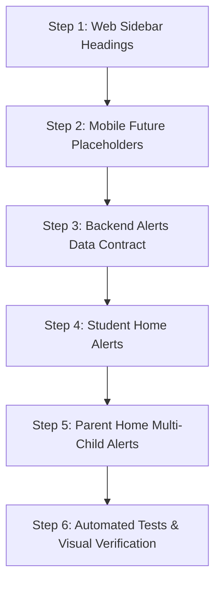

# SESSION-HANDOFF-19: Website Sidebar Headings Redesign, Mobile Future-Feature Placeholders, and Student & Parent Home Important Alerts System

> **Target Session:** Session 19  
> **Status:** READY FOR IMPLEMENTATION  
> **Branch:** `slice/office-feedback` (or session 19 branch)  
> **Current Baseline:**  
> - Backend Tests: **760 passed, 1 skipped, 0 failed** (`../.venv/Scripts/python.exe -m pytest -q`) — 100% green  
> - Web Tests: **109 passed, 2 skipped** across 20 files (`npm test` in `web/`) — 100% green  
> - Web Typecheck: **0 errors** (`npx tsc --noEmit` in `web/`)  
> - Mobile Typecheck: **0 errors** (`npx tsc --noEmit` in `mobile/`)  
> - Alembic Migration Head: `a1b2c3d4e5f8`  
> - Visual Verifications Completed: 6/6 Teacher Leave lifecycle screenshots + 15/15 Parent Hindi i18n screenshots verified  

---

## 1. OBJECTIVES & DETAILED SPECIFICATION

Session 19 encompasses three primary engineering domains across the web dashboard and mobile application:

### Domain 1: Website — Redesign Sidebar Section Headings
- **Problem Statement:**  
  Currently, in `web/src/layout/Shell.tsx`, sidebar group headers (`Admission`, `People`, `Academics`, `Money`, `Communication`, `Operations`, `Administration`, `Analytics`, `Front Desk`) render as plain, muted text:
  ```tsx
  <p className="px-3 pb-1 text-[11px] uppercase tracking-wider font-semibold text-white/50">
    {group}
  </p>
  ```
  This creates low contrast, weak hierarchy, and a flat visual appearance.
- **Specification:**
  - Redesign headings across **all website roles** (Super Admin, Principal, Admin, Fee Collector, Receptionist, Exam Controller, Teacher, etc. — all share `Shell.tsx` and `groupedNav`).
  - **Non-clickable & Structural:** Section headers must remain non-interactive labels used purely to group related navigation items.
  - **Clear Visual Hierarchy:** Enhance typography (tracking, weight, letter spacing), spacing, alignment, and subtle brand accents (e.g. subtle pill badge, left accent pip/border, fine divider lines, or elevated surface styling) matching the Sunrise Public School brand (`#1e3a8a` deep navy primary background).
  - **Preserve Navigation:** Do not alter the actual routing, route paths, permissions, or screen definitions in `web/src/screens.ts`.

---

### Domain 2: Mobile App — Future Feature Placeholders (Roadmap UI)
- **Scope Rule:**  
  **DO NOT implement backend APIs, tables, database migrations, calling infra, WebRTC, or socket chat systems.** This is purely client-side placeholder UI for the future roadmap.
- **Visual & Interaction Specs:**
  - Rendered with disabled/greyed styling (`opacity: 0.5` or `theme.inkFaint`).
  - Distinct **"Coming Soon"** pill/badge (e.g. subtle rounded pill with `theme.inkFaint` or `theme.primarySoft`).
  - Strictly non-interactive (`disabled={true}`, no navigation on click/press, no broken redirects).
- **Target Menus & Items:**
  1. **Parent (`mobile/src/components/NavDrawer.tsx` / Communication Section):**
     - **Call Class Teacher — Coming Soon** (roadmap: will use native phone dialer `tel:`, not VoIP).
     - **Message Class Teacher — Coming Soon** (roadmap: will be two-way parent ↔ class teacher chat).
  2. **Teacher (`mobile/src/components/NavDrawer.tsx`):**
     - Under `ACADEMICS`: **Today's Class — Coming Soon** (roadmap: teacher records daily class log/notes for students).
     - Under `COMMUNICATION`: **Parent Messages — Coming Soon** (roadmap: two-way teacher ↔ parent messaging).
  3. **Student (`mobile/src/components/NavDrawer.tsx`):**
     - Under `ACADEMICS`: **Today's Class — Coming Soon** (roadmap: read-only daily class notes/messages from teacher).
     - *Design Rule:* Students must **never** have direct messaging with teachers. Communication model is Teacher → Student (Class notes) and Teacher ↔ Parent (Two-way messaging).

---

### Domain 3: Student & Parent Home — Important Alerts System (FULLY FUNCTIONAL)
- **Critical Requirement:**  
  This is a **LIVE, REAL-TIME FEATURE**, not a placeholder. Must be built end-to-end using existing ERP database models, calculations, and APIs.
- **Alert Card Design & UX:**
  - Placed prominently at the top of the Home tab (below welcome header, above summary cards) in:
    - `mobile/app/(student)/dashboard.tsx`
    - `mobile/app/(parent)/dashboard.tsx`
  - **Conditional Rendering:** Render the alert container **only** when at least one alert applies. If no alerts apply, render nothing (no empty cards).
  - **Tappable Navigation:** Tapping an alert directly navigates to the existing screen:
    - Attendance Shortage → `/(student)/attendance` or `/(parent)/attendance`
    - Fee Due → `/(parent)/fees`
    - Report Card → `/(student)/results` or `/(parent)/results`
    - Periodic Test → `/(student)/results` or `/(parent)/results`

#### Alert Definitions & Data Rules:
1. **Attendance Shortage Alert (< 75%):**
   - Condition: `attendance_percent !== null && attendance_percent < 75.0`.
   - Data Source: Actual attendance calculation (`attendance.student_percent` in backend).
   - Display:
     - Icon: ⚠️
     - Title: `Attendance Shortage` (or `Attendance Shortage — {ChildName}` for parent)
     - Message: `Your attendance is {percent}%. Minimum required attendance: 75%.`
     - Automatically disappears when attendance >= 75%.
2. **Fee Due Alert:**
   - Condition: Outstanding balance > 0 or unsettled invoices exist.
   - Data Source: Existing invoice/ledger system (`fees.list_invoices` balance).
   - Display:
     - Icon: 💰
     - Title: `Fee Due` (or `Fee Due — {ChildName}` for parent)
     - Message: `₹{amount} outstanding. View Fees →`
     - Automatically disappears when fees are cleared.
3. **Report Card Available Alert:**
   - Condition: A term report card / terminal examination result is published.
   - Data Source: Existing exam/marks lock & publication system (`assessment.py`).
   - Display:
     - Icon: 📄
     - Title: `Report Card Available` (or `Report Card Available — {ChildName}` for parent)
     - Message: `{Exam/Term Name} Report Card is now available. View Report Card →`
4. **Periodic Test Result Alert:**
   - Condition: A Periodic Test (PT) exam result is published for the class.
   - Data Source: Existing `Exam` where scheme component code is `PT` / periodic test.
   - Display:
     - Icon: 📊
     - Title: `Periodic Test Result Available` (or `Periodic Test Result Available — {ChildName}` for parent)
     - Message: `{Test Name} results are now available. View Results →`

---

### Domain 4: Parent With Multiple Children Handling
- A parent account may be linked to multiple children (`me.children` array from `useAuth()`).
- **Independent Evaluation:** Alerts must be evaluated **separately for each child**.
- **Child Attribution:** When displaying alerts on Parent Home, clearly display the child's name in each alert pill/card:
  ```text
  ⚠️ Attendance Shortage — Rahul
  Attendance: 72% (Min: 75%)
  
  💰 Fee Due — Priya
  ₹8,500 outstanding
  
  📄 Report Card Available — Rahul
  Term 1 Report Card is now available
  ```
- **Child Context Switching:** When a parent taps an alert for a specific child (e.g. Priya's fee), the app must invoke `selectChild(childId)` in `AuthContext` before navigating to the destination screen so the target screen loads the correct child's data!
- If no children have alerts, the alert section remains completely hidden.

---

## 2. CODEBASE ARCHITECTURE & EXTENSION POINTS

### A. Web Sidebar (`web/src/layout/Shell.tsx`)
- Lines 78–107: `groupedNav(can, hasModule, userRoles)` groups screens by `group`.
- Refactor the group header rendering:
  - Add visual grouping styling: subtle line separator or pill container, uppercase tracking, improved typography (`text-xs font-bold text-white/90`), and subtle icon or accent bar on the left.
  - Verify across all role logins (Admin, Fee Collector, Teacher, Receptionist).

### B. Mobile Navigation Drawer (`mobile/src/components/NavDrawer.tsx`)
- Type `MenuItem`:
  ```ts
  type MenuItem = {
    id: string;
    title: string;
    icon: keyof typeof Ionicons.glyphMap;
    path?: string;
    action?: () => void;
    disabled?: boolean;
    badge?: string; // "Coming Soon"
  };
  ```
- In `sections` definition:
  - **Parent:** Add `COMMUNICATION` section with `Call Class Teacher` (`disabled: true, badge: "Coming Soon"`, icon: `call-outline`) and `Message Class Teacher` (`disabled: true, badge: "Coming Soon"`, icon: `chatbubble-ellipses-outline`).
  - **Teacher:** Add `Today's Class` to `ACADEMICS` (`disabled: true, badge: "Coming Soon"`, icon: `create-outline`) and `Parent Messages` to `COMMUNICATION` (`disabled: true, badge: "Coming Soon"`, icon: `chatbubbles-outline`).
  - **Student:** Add `Today's Class` to `ACADEMICS` (`disabled: true, badge: "Coming Soon"`, icon: `newspaper-outline`).
- In rendering loop (lines 481–500):
  - Check `item.disabled`. If true, render with opacity 0.5, no `onPress` action, and render a small rounded badge `<View style={styles.comingSoonBadge}><Text style={styles.comingSoonText}>{item.badge}</Text></View>`.

### C. Backend API Endpoints for Alerts
1. **Student Dashboard (`backend/app/api/student/dashboard.py`):**
   - Enhance response payload to include:
     - `fee_due_amount`: Outstanding balance (float).
     - `latest_report_card`: `{ exam_id: int, title: str }` or `None`.
     - `latest_periodic_test`: `{ exam_id: int, title: str }` or `None`.
2. **Parent Children Summary / Alerts (`backend/app/api/parent/children.py`):**
   - In `GET /parent/children/{student_id}/summary` or a batch endpoint `GET /parent/alerts`:
     - Return alerts for all children or include `fee_due_amount`, `latest_report_card`, and `latest_periodic_test` in summary.
     - For multi-child parents, evaluate alerts across all children in `scoping.child_ids_for(db, user)`.

### D. Mobile Dashboard / Home UI
1. **Student Dashboard (`mobile/app/(student)/dashboard.tsx`):**
   - Introduce an `AlertBanner` or `AlertCard` section at top.
   - Map active alerts (Attendance < 75%, Fee Due > 0, Report Card available, Periodic Test available).
   - Each card is styled with status color (warning amber, info blue, fee danger), has icon, text, and `onPress` navigating to relevant tab/screen.
2. **Parent Dashboard (`mobile/app/(parent)/dashboard.tsx`):**
   - Iterate through `me.children` or summary data.
   - For each child, collect active alerts with `{ childId, childName, alertType, title, message, route }`.
   - Render multi-child alert cards clearly tagged with `— {childName}`.
   - When tapped: `selectChild(alert.childId); router.push(alert.route);`.

---

## 3. STEP-BY-STEP IMPLEMENTATION PLAN



1. **Step 1: Web Sidebar Section Headings**
   - Update `web/src/layout/Shell.tsx`.
   - Style group headers with professional ERP hierarchy: subtle dividers, letter-spacing, uppercase styling, crisp font weight, high-contrast readable text.
   - Verify visually across multiple web roles.

2. **Step 2: Mobile Navigation Drawer Future Placeholders**
   - Update `mobile/src/components/NavDrawer.tsx`.
   - Add disabled placeholders for Parent, Teacher, and Student with "Coming Soon" badges.
   - Ensure items are non-interactive and styled cleanly without breaking drawer navigation.

3. **Step 3: Backend Alerts Data Contract**
   - Update `backend/app/api/student/dashboard.py` to return fee dues, latest report card, and latest periodic test.
   - Update `backend/app/api/parent/children.py` to return complete alert data per child.
   - Add backend tests in `backend/tests/test_alerts.py`.

4. **Step 4: Student Home Alerts Component**
   - Create reusable `AlertsSection.tsx` in `mobile/src/components/` or inline in `dashboard.tsx`.
   - Evaluate attendance shortage (< 75%), fee dues, report cards, and periodic test results.
   - Make cards tappable to navigate to respective screens.

5. **Step 5: Parent Home Alerts with Multi-Child Support**
   - Update `mobile/app/(parent)/dashboard.tsx` to evaluate alerts across all `me.children`.
   - Label alerts with child names (`— Rahul`, `— Priya`).
   - On tap: set active child via `selectChild(childId)` and navigate to target screen.

6. **Step 6: Verification & Test Suites**
   - Run backend test suite: `../.venv/Scripts/python.exe -m pytest -q`.
   - Run web test suite: `cd web && npm test`.
   - Run web typecheck: `cd web && npx tsc --noEmit`.
   - Run mobile typecheck: `cd mobile && npx tsc --noEmit`.
   - Capture visual verification screenshots for web sidebar and mobile alerts.

---

## 4. VERIFICATION COMMANDS

```pwsh
# 1. Backend tests
cd backend
..\.venv\Scripts\python.exe -m pytest -q

# 2. Web tests & TypeScript
cd web
npm test
npx tsc --noEmit

# 3. Mobile TypeScript
cd mobile
npx tsc --noEmit
```
