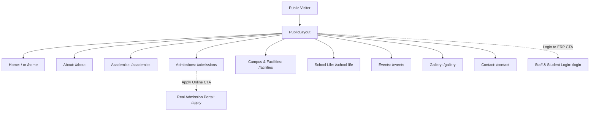

# SESSION-HANDOFF-21: Public-Facing School Website Modernization

> **Target Session:** Session 21  
> **Status:** COMPLETED & VERIFIED — PHASES 1 & 2 COMPLETE (ALL 9 PAGES, MASTER PHOTOGRAPHY & LIGHTBOX, TESTS 100% GREEN)  
> **Canonical Branch:** `slice/office-feedback` (synced with `origin/main`)  
> **Current Verified Baseline:**  
> - Backend Tests: **770 passed, 1 skipped, 0 failed** (`../.venv/Scripts/python.exe -m pytest -q`) — 100% green  
> - Web Tests: **114 passed, 2 skipped** across 20 files (`npm test` in `web/`) — 100% green  
> - Web Typecheck: **0 errors** (`npx tsc --noEmit` in `web/`)  
> - Mobile Typecheck: **0 errors** (`npm run typecheck` in `mobile/`)  
> - Production Bundle: **Clean Vite build** (`npm run build` in `web/`) in 7.03s  
> - Visual Verification Suite: **17 screenshots captured and documented** (`docs/screenshots/session21/` and conversation artifact directory).  

---

## 1. Executive Context & Scope Boundary

The Sunrise School ERP repository contains three distinct, interconnected tiers:
1. **Public-Facing School Website**: The public front door for prospective parents, students, and community members.
2. **School ERP Web Application**: The role-gated internal portal (`/login` -> `/dashboard`, `/students`, `/fees`, `/academics`, etc.) used by Admin, Teachers, Accountants, and Receptionists.
3. **Expo Mobile Application**: The cross-platform mobile client for Students, Parents, and Teachers.

### Strict Scope Boundary
- **The current scope is EXCLUSIVELY to upgrade the PUBLIC-FACING WEBSITE.**
- Do **NOT** alter, redesign, or break the ERP shell (`web/src/layout/Shell.tsx`), internal ERP screens (`web/src/screens.ts`), or mobile application routes.
- Do **NOT** create a second backend, duplicate database models, or fake admissions storage.
- All admissions CTAs ("Apply Online") must route directly to the existing, fully functional public admission portal at `/apply` (`web/src/pages/public/PublicApplyPage.tsx`), which communicates with the FastAPI backend (`/public/{school_code}/admission-enquiries` and `/public/{school_code}/admission-applications`).

---

## 2. Institutional Identity & Fictional Profile

The website must reflect the authenticity and tone of an established, modern Indian private school affiliated with CBSE:

| Attribute | Specification |
|:---|:---|
| **School Name** | **Sunrise School** (or Sunrise Public School) |
| **Location** | **Gomti Nagar, Lucknow, Uttar Pradesh** |
| **Affiliation** | **CBSE Affiliated** (K–12: Nursery to Grade 12) |
| **Established** | **2011** |
| **Motto / Ethos** | *"Nurturing Curious Minds. Building Confident Futures."* |
| **Streams Offered** | Science, Commerce, Humanities (Senior Secondary) |
| **Verification Rule** | **Do NOT invent a real CBSE affiliation number, government recognition number, or fake national ranking awards.** Use carefully crafted, believable educational descriptions. |

---

## 3. Information Architecture & Route Mapping

The public website utilizes `web/src/components/public/PublicLayout.tsx` and routes defined in `web/src/App.tsx`. The navigation architecture must be organized into 9 primary public views:



### Route Registry (`web/src/App.tsx`)
1. `/` & `/home` — [`HomePage.tsx`](web/src/pages/public/website/HomePage.tsx) (Revamped school homepage)
2. `/about` — [`AboutPage.tsx`](web/src/pages/public/website/AboutPage.tsx) (Heritage, philosophy, leadership, vision & mission)
3. `/academics` — [`AcademicsPage.tsx`](web/src/pages/public/website/AcademicsPage.tsx) (Curriculum stages, experiential learning, assessment)
4. `/admissions` — [`AdmissionsPage.tsx`](web/src/pages/public/website/AdmissionsPage.tsx) (Intake process, eligibility, fee structure overview, FAQs, link to `/apply`)
5. `/facilities` — [`FacilitiesPage.tsx`](web/src/pages/public/website/FacilitiesPage.tsx) (Classrooms, labs, sports, library, safety, transport)
6. `/school-life` — `SchoolLifePage.tsx` *(New)* (Clubs, co-curriculars, sports, arts, community outreach)
7. `/events` — `EventsPage.tsx` *(New)* (Upcoming & past calendar events, academic and cultural highlights)
8. `/gallery` — `GalleryPage.tsx` *(New)* (Categorized responsive visual showcases)
9. `/contact` — `ContactPage.tsx` *(New)* (Gomti Nagar campus address, contact form, inquiry CTAs, office timings)
10. `/apply` — [`PublicApplyPage.tsx`](web/src/pages/public/PublicApplyPage.tsx) *(Existing — preserve intact!)*

---

## 4. Visual Design System & Aesthetic Directives

### A. Design Principles: Authentic Indian CBSE School
- **Tone**: Established, warm, trustworthy, academic, child-friendly, modern.
- **Palette**:
  - **Primary Navy**: `#042954` / `#0a2540` / `#1e3a8a` (Deep academic navy echoing the redesigned ERP sidebar and school crest).
  - **Warm Amber Accent**: `#f59e0b` / `#d97706` / `#ffa726` (Sunburst gold/amber for badges, active states, key CTAs).
  - **Warm Neutrals & Ivory**: `#f8fafc`, `#f1f5f9`, `#ffffff` (Clean editorial backgrounds; avoid stark clinical grays).
  - **Text Ink**: `#0f172a` (Slate 900) for primary headlines, `#334155` (Slate 700) for body copy, `#64748b` (Slate 500) for metadata.
- **Typography & Hierarchy**:
  - High-impact serif or dignified sans headlines (e.g. `font-serif` or bold `font-sans` with refined letter-spacing).
  - Editorial rhythm: Alternating rich narrative blocks, quote callouts, and clean asymmetrical columns instead of relentless identical 3-card grids.
- **Strict Visual Don'ts**:
  - NO generic SaaS neon gradients or tech startup aesthetics.
  - NO excessive glassmorphism or floating neon blobs.
  - NO artificial dashboard cards with progress bars on public narrative pages.
  - NO cheesy stock photo placeholders; build cleanly with modular image slots that can load generated school assets.

### B. Header (`web/src/components/public/PublicNavbar.tsx`)
- **Desktop**:
  - Left: Sunrise School emblem/crest + "Sunrise School" + subtitle "Gomti Nagar • Lucknow".
  - Center: Horizontal navigation links (Home, About, Academics, Admissions, Campus, School Life, Events, Gallery, Contact) with clean active and hover states.
  - Right:
    - Primary CTA: **"Admissions Open"** / **"Apply Online"** (vibrant amber button linking to `/apply` or `/admissions`).
    - Secondary CTA: **"Login to ERP"** (bordered navy button linking to `/login`).
  - Sticky / Scroll behavior: Clean, non-distracting blur or solid shadow on scroll, maintaining moderate height (`h-20` or `h-16`).
- **Mobile**:
  - Brand mark + School Name.
  - Prominent "Apply" or "ERP" quick pill.
  - Clean slide-down or off-canvas hamburger drawer with full navigation, direct admission link, and ERP portal link.

### C. Footer (`web/src/components/public/PublicFooter.tsx`)
- Substantial, authoritative 4-column school footer:
  1. **School Profile**: Crest, motto, brief story, CBSE affiliation statement, Gomti Nagar address.
  2. **Explore**: Quick links to About, Academics, Campus & Facilities, School Life, Gallery.
  3. **Admissions & ERP**: Admission Process, Fee Policy, Apply Online (`/apply`), Staff & Student ERP Login (`/login`).
  4. **Contact & Office Hours**: Phone, email, visiting hours (Mon–Sat: 8:00 AM – 3:30 PM), map link.
- Bottom bar: Fictional copyright, mandatory policy links (Mandatory Public Disclosures, Privacy Policy, Terms of Service).

---

## 5. Page-by-Page Specifications

### 1. Home Page (`HomePage.tsx`)
- **Hero Section**:
  - Eyebrow: *"Admissions Open • Academic Session 2026–27"*
  - Headline: *"Nurturing Curious Minds. Building Confident Futures."*
  - Supporting narrative on Sunrise School's 15-year legacy of holistic CBSE education in Gomti Nagar.
  - Actions: Primary *"Explore Our School"* (`/about`), Secondary *"Admissions"* (`/admissions`), Tertiary *"Apply Online →"* (`/apply`).
  - Large visual anchor: High-quality school campus hero image container.
- **Why Sunrise**: Distinctive pillars (e.g., Conceptual CBSE Rigor, 1:15 Early Years Ratio, Experiential STEM & Tinkering, Sports & Cultural Heritage).
- **Leadership / Principal's Message**: High-profile message from the Principal (Dr. Ananya Sengupta) on child-centric development.
- **Academic Journey Snapshot**: Visual roadmap from Foundation (Nursery–UKG) to Senior Secondary (Grades 11–12).
- **Campus & Life Highlights**: Editorial preview of smart classrooms, science labs, and sports arenas.
- **Recent Happenings & Events Preview**: Date-stamped cards with category badges (Sports, Annual Day, Science Fair).
- **Parent & Community Perspectives**: Believable, warm parent quotes regarding academic care and personal growth.
- **ERP Gateway Banner**: Clean institutional callout providing direct access for existing students, teachers, and staff (`/login`).

### 2. About Page (`AboutPage.tsx`)
- **The Sunrise Story**: Founded in 2011 to serve families in Gomti Nagar and greater Lucknow with values-led education.
- **Vision & Mission**: Clearly demarcated vision and mission statements.
- **Core Values**: 5 foundational pillars (Integrity, Curiosity, Compassion, Resilience, Excellence).
- **Leadership & Governance**: Principal's address and message from the School Management Committee.
- **Campus Environment & Holistic Care**: Safety, green campus initiatives, pastoral care.

### 3. Academics Page (`AcademicsPage.tsx`)
- **Academic Philosophy**: CBSE curriculum framework integrated with NEP 2020 experiential learning principles.
- **Four Distinct Divisions**:
  1. *Foundational Stage (Nursery – Grade 2)*: Activity-based play-way learning, phonics, numeracy.
  2. *Preparatory & Middle Stage (Grades 3 – 8)*: Subject foundations, STEM discovery, languages, social sciences.
  3. *Secondary School (Grades 9 – 10)*: Board exam preparation, laboratory sciences, co-curricular balance.
  4. *Senior Secondary (Grades 11 – 12)*: Rigorous Science, Commerce, and Humanities streams with career counseling.
- **Methodology & Assessment**: Continuous & Comprehensive Evaluation, periodic tests, skill-based project assessments.

### 4. Admissions Page (`AdmissionsPage.tsx`)
- **Admissions Overview**: Welcoming applicants for the 2026–27 session across Nursery to Grade 11.
- **Step-by-Step Admission Process**:
  1. Online Enquiry & Registration (`/apply`)
  2. Interaction / Readiness Assessment (Grade-appropriate)
  3. Document Verification & Provisional Offer
  4. Fee Submission & Enrollment Confirmation
- **Document Checklist**: Birth certificate, previous report cards, transfer certificate (TC), address proof, passport photos.
- **Selection Criteria & RTE 25% Information**: Transparent explanation of age criteria and Right to Education provisions.
- **Primary Call to Action**: Prominent *"Submit Online Application"* button routing directly to `/apply`.
- **Frequently Asked Questions**: Accordion addressing age cutoffs, transport availability, sibling concessions, and school timings.

### 5. Campus & Facilities Page (`FacilitiesPage.tsx`)
- **Facility Showcase**:
  - Smart Interactive Classrooms (digital boards, ergonomic furniture)
  - Composite Science Laboratories (Physics, Chemistry, Biology)
  - High-Tech Computer & Robotics Lab
  - Library & Resource Center (over 10,000 titles and digital journals)
  - Sports Infrastructure (Basketball court, cricket nets, indoor badminton, track)
  - Creative Arts & Music Studio
  - Safety & Security (CCTV surveillance, GPS-enabled school transport, infirmary with certified nurse)
- Pluggable image slots ready for generated assets.

### 6. School Life Page (`SchoolLifePage.tsx`) — *New*
- **Beyond Academics**: Life on campus, daily routines, student houses (Agni, Prithvi, Vayu, Jal).
- **Clubs & Societies**: Robotics Club, Debate Society, Eco Warriors, Literary Club, Performing Arts.
- **Sports & Athletics**: Physical education curriculum, annual sports meet, inter-school tournaments.
- **Community & Social Responsibility**: Student council initiatives, environmental drives.

### 7. Events & Calendar Page (`EventsPage.tsx`) — *New*
- **School Calendar Overview**: Academic term dates, major holidays, parent-teacher meetings.
- **Featured & Upcoming Events**: Realistic demo events (e.g. *Annual Science & Innovation Expo*, *Inter-House Sports Meet*, *Literary Fest 2026*, *Winter Carnival*).
- Filtering by category (Academic, Cultural, Sports, Admissions).

### 8. Gallery Page (`GalleryPage.tsx`) — *New*
- **Responsive Media Grid**: Category tabs (All, Campus, Classrooms, Sports, Cultural, Events).
- High-quality image card presentation with captions and modal lightbox or clean visual presentation.

### 9. Contact Page (`ContactPage.tsx`) — *New*
- **Campus Address**: Sector 4, Gomti Nagar, Lucknow, Uttar Pradesh 226010.
- **Direct Contacts**: Admissions Desk, Administrative Office, Transport Desk.
- **Visiting & Office Hours**: Mon–Fri: 8:00 AM – 3:30 PM, Sat: 8:00 AM – 1:00 PM.
- **Interactive Enquiry Form**: Connects to the public enquiry mechanism or provides direct guidance to `/apply`.
- **Campus Location Map**: Clean placeholder/styled map container showing Gomti Nagar accessibility.

---

## 6. Engineering Invariants & Testing Strategy

1. **ERP Shell & Route Isolation**:
   - The ERP shell (`web/src/layout/Shell.tsx`) and the 32 operational screens in `web/src/screens.ts` must remain completely untouched.
   - All public pages live under `web/src/pages/public/website/` and use `PublicLayout.tsx`.
2. **Real Backend Integration via `/apply`**:
   - Never replace or bypass `PublicApplyPage.tsx`. The "Apply Online" CTAs must link to `/apply`.
3. **No Verifiable Claims Invariant**:
   - Do not display real CBSE affiliation numbers or rankings.
4. **Test Suite Integrity**:
   - Update `web/src/pages/public/website/Website.test.tsx` to test the expanded navbar, new pages (School Life, Events, Gallery, Contact), and updated header/footer assertions.
   - Run `npm test` in `web/` to guarantee all 109+ tests pass.
   - Run `npx tsc --noEmit` in `web/` to guarantee 0 TypeScript errors.

---

## 7. Session 21 Phase 2 — Realistic Photography & Cohesive Visual Storytelling

### A. Core Directives Executed
1. **Believable Institutional Photography**:
   - Replaced all gradient or generic placeholders with 13 custom-generated, photorealistic campus images.
   - Built a consistent visual identity matching Sunrise School, Gomti Nagar, Lucknow:
     - **Architecture**: Red terracotta stone and buff sandstone campus with sun louvers, lush Ashoka tree avenues, and crisp signage ("SUNRISE SCHOOL, GOMTI NAGAR, LUCKNOW").
     - **Uniform Identity**: Crisp white collared shirts, navy blue ties with subtle diagonal gold stripes, navy trousers/skirts, and embroidered school crest.
     - **Facilities**: Atal Tinkering Lab with Arduino robotics, composite science laboratory with burettes/glassware, 60-seat computer programming suite, central wooden library, acoustic Indian music room, fine arts studio with pottery/easels, outdoor football turf & 400m track, and indoor multi-sport arena.

### B. Master Photo Registry (`web/src/pages/public/website/schoolPhotos.ts`)
- All photos saved in `web/public/images/school/` (root-relative serving) and mirrored to `web/src/assets/school/`.
- Typed dictionary `SCHOOL_PHOTOS` with metadata (title, category, caption, location, orientation).
- 13 master assets:
  1. `hero_campus_exterior.jpg` — Campus Main Building & Lawns
  2. `school_entrance_gate.jpg` — Main Gate No. 1 & Palm Avenue
  3. `main_reception_lobby.jpg` — Administrative Welcome Rotunda
  4. `modern_classroom_learning.jpg` — Smart Interactive Classroom
  5. `teacher_mentoring_students.jpg` — Personalized Faculty Mentorship
  6. `science_lab_practical.jpg` — Composite Science Practical Lab
  7. `computer_lab_coding.jpg` — Advanced Computer & AI Studio
  8. `central_library_reading.jpg` — Central Knowledge Hub & Stacks
  9. `stem_robotics_activity.jpg` — Atal Tinkering Lab & Robotics Hub
  10. `art_studio_painting.jpg` — Visual Arts & Ceramic Studio
  11. `music_room_performing.jpg` — Indian & Western Acoustic Music Suite
  12. `sports_field_athletics.jpg` — Athletic Turf & Football Grounds
  13. `indoor_sports_arena.jpg` — Multi-Court Indoor Sports Arena

### C. Page-by-Page Photography Integration
- **`HomePage.tsx`**: Hero background banner, 3 Academic Stage Wing photo headers, 4 Facilities preview cards, 4-photo "Campus Experience in Focus" showcase.
- **`AboutPage.tsx`**: Entrance Gate & Welcome Rotunda journey photos, Faculty Mentorship spotlight.
- **`AcademicsPage.tsx`**: Classroom, STEM lab, and Science lab headers on Stage cards; Computing Lab banner on Technology Learning.
- **`AdmissionsPage.tsx`**: Welcome Rotunda photo on the Online Admissions Portal intake card.
- **`FacilitiesPage.tsx`**: Photo banners across all major facility cards; 2-column security section with Main Gate photo.
- **`SchoolLifePage.tsx`**: Dual-panel Sports Photography showcase (outdoor turf & indoor arena); club photo headers (Robotics, Coding, Music, Art, Library).
- **`EventsPage.tsx`**: Photo cards for Science Expo, PTM, Tarang Sports Meet, Udaan Cultural Fest, Winter Carnival.
- **`GalleryPage.tsx`**: Full 13-photo responsive gallery grid across 5 filter tabs; interactive modal Lightbox with previous/next arrows, keyboard support, location pills, and captions.
- **`ContactPage.tsx`**: Entrance Gate photo visual card in the Gomti Nagar campus locator.

---

## 8. Phase 3: Public Admission Portal Integration (`/apply`) & Mock Payment Gateway

### A. Core Architectural Invariants Preserved
- **Zero Separate Databases**: Uses the existing FastAPI backend (`backend/app/api/public/admission.py`), PostgreSQL database, and ERP Admission Cell.
- **Sole Atomic Enrollment Trigger**: Successful fee payment is the **sole atomic enrollment trigger** (creates `Student`, `Enrolment` with section and roll number, `User` login `Student@123`, `FeeInvoice` with fee head `ADMISSION`, and FIFO `FeePayment` allocation). There is no separate manual "Convert to Student" button.
- **Dynamic Fee Sourcing**: Payable amounts are strictly derived from the backend admission offer (`payable_amount`). No hardcoded fees.
- **Privacy & Enumeration Protection**: Status lookups require **Application Reference Number + Registered Guardian Mobile Number** (returns uniform 404 on mismatches).
- **Gated Official Documents**: Official admission letters, receipts, and completed application dossiers are strictly gated behind payment and enrollment (HTTP 403 otherwise).

### B. Delivered Capabilities
1. **7-Step Wizard Architecture (`PublicApplyPage.tsx`)**:
   - **Step 1: Student Information**: Legal name, DOB (with `htmlFor`/`id` accessibility), gender, class & stream, nationality, religion, caste category, quota category, Aadhaar last 4 digits, second language choice, bus transport requirement, and passport photo upload.
   - **Step 2: Parent & Guardian Details**: Primary parent (qualification, occupation, designation, organisation, income band, office address, alternate phone, photo), optional secondary guardian, and authorized gate pickup persons (escort authorizations with photo and notes).
   - **Step 3: Academic History**: Previous school name, board, last class passed, percentage/grade, and TC reference number.
   - **Step 4: Health Record & Siblings**: Sibling studying at Sunrise School toggle (name, age, class/ID), blood group selector, allergies, chronic conditions, regular medications, emergency doctor & phone, emergency medical treatment consent.
   - **Step 5: Document Uploads**: Universal file uploader supporting `.pdf`, `.jpg`, `.jpeg`, `.png`, `.webp` up to 10MB (Birth Certificate, Address Proof, Previous Marksheet, Parent ID proof).
   - **Step 6: Review & Mandatory Declarations**: Comprehensive review cards per category with edit buttons; Step 9 explicit, never pre-ticked declarations for accuracy, school rules, data processing consent, and optional media consent; bot honeypot.
   - **Step 7: Application Confirmation**: Official Application Reference Number (`APP-YYYY-NNNN`), status badge, next steps guide, print submission slip button, and direct link to status tracking.
2. **Application Status Tracking**:
   - Look up with Application Number + Guardian Mobile Number.
   - Visual 4-stage journey timeline: **Submitted -> Review -> Offer & Fee -> Enrolled**.
   - When **Offer Issued / Fee Pending**: Prominent Admission Offer Card showing class offered, offer expiry date, exact fee payable, and "Pay Admission Fee Online" CTA.
3. **Controlled Mock Payment Gateway Modal**:
   - Realistic Razorpay / BillDesk style checkout interface.
   - Payment method tabs: **UPI / QR Code** (with dynamic mock QR and `sunrise.sps@icici` VPA), **Cards (Debit/Credit)**, and **Net Banking** (SBI, HDFC, ICICI, Axis).
   - Simulation control triggers:
     - "Simulate Payment Success" -> calls `/payments/process` with `{ scenario: "success", idempotency_key }`
     - "Simulate Payment Failure" -> calls `/payments/process` with `{ scenario: "failure" }`
     - "Cancel Payment" -> calls `/payments/process` with `{ scenario: "cancel" }`
4. **Enrolled State Experience & Documents Hub**:
   - Celebratory Enrollment Banner with permanent Admission Number, allocated Class & Section, Roll Number, and Fee Receipt Number.
   - **Student ERP Login Credentials Card**: Guidance for student portal login at `/login` with Student User ID = Admission No and default password `Student@123`.
   - **Official Gated Documents Center**: In-browser preview modals with `@media print` styling for:
     1. Completed Application Dossier (comprehensive profile with photos and guardian contacts)
     2. Official Provisional Admission Letter (signed by Principal Dr. Sunita Sharma)
     3. Fee Payment Receipt Voucher (with amount in words and transaction reference)

---

## 9. Verification & Visual Proofs Baseline (100% Green)

| Test Suite / Check | Command | Result |
|:---|:---|:---|
| Backend Full Test Suite | `..\.venv\Scripts\pytest -q` in `backend/` | **775 passed, 1 skipped** (100% green) |
| Backend Admission Workflow | `..\.venv\Scripts\pytest tests/test_public_admission_workflow.py -q` | **5 passed, 0 failed** (100% green) |
| Web Unit Tests | `npm test -- --run` in `web/` | **120 passed, 2 skipped across 21 test files** (100% green) |
| Web Admission Portal Tests | `npm test -- src/pages/public/PublicApplyPage.test.tsx --run` | **6 passed, 0 failed** (100% green) |
| Web TypeScript | `npx tsc --noEmit` in `web/` | **0 errors** |
| Mobile TypeScript | `npm run typecheck` in `mobile/` | **0 errors** |
| Production Build | `npm run build` in `web/` | **Clean Vite build in 9.49s** |
| Visual Screenshots | `verify_website_pages.mjs` in `web/` | **17 screenshots captured** in `docs/screenshots/session21/` |

---

## 10. Next Session Implementation Prompt (Session 22)

```markdown
Read SINGLE_SOURCE_OF_TRUTH.md, CLAUDE.md, and SESSION-HANDOFF-21.md before starting.

We are continuing development on the Sunrise School ERP project. All public website deliverables (9 public pages, 13 master AI-generated photographs, photo registry, gallery lightbox, 17 visual proof screenshots), public admission workflow integration (7-step wizard, status lookup with mobile, mock payment gateway with UPI/Card/NetBanking, atomic conversion on fee payment, student credentials, gated official printable documents), and engineering invariants (775 backend tests, 120 web tests, 0 TS errors, clean Vite build) are 100% green.

Proceed with the next planned operational priorities or user directives for Session 22.
```


