# The Sunrise ERP database

A reference for every table in `sunrise_test`: what it is for, every column it
has, and how it joins to the rest.

**86 tables, 990 columns, 226 foreign keys.** Of those tables **58 hold data** in
the seeded demo school and **28 are empty** - not unfinished, simply features
this demo school has not exercised.

Columns, types, foreign keys and row counts below were **introspected from the
running database**, not written by hand, so they cannot have drifted from what
Postgres actually enforces. Each table's purpose is taken from the model's own
docstring where it has one.

> Generated against migration `c3f61e0a77d2` on branch `slice/office-feedback`.
> Row counts come from the seeded demo school and will differ on yours.

## How to read this schema

Five rules explain why the tables look the way they do. Without them the list
below is just nouns.

**1. Almost every table carries `school_id`.** This is a multi-tenant product
sold to separate, independent schools - a tenant is a customer, not a branch. The
column is declared on `TenantBase` so a new table cannot quietly be created
without one; a missing tenant key is a data leak between customers, not a style
problem. Three tables derive from `TimestampedBase` instead and have none, each
for a reason: `schools` *is* the tenant, and `permissions` and `scheduled_jobs`
are vocabulary belonging to the software rather than to any one school.
`alembic_version` is Alembic's own row and not part of the product at all.

**2. Year-scoped facts hang off `enrolment_id`; lifetime facts hang off
`student_id`.** A fee, an attendance mark, a bus seat and a set of marks all
belong to a child's *year in a class*, so they point at `enrolments`. A name, a
date of birth and an admission number belong to the child for life, so they
point at `students`. Getting this backwards silently carries last year's data
into the new class, which is the bug the enrolment split exists to prevent.

**3. Money is never edited.** An invoice is voided and reissued; a payment is
reversed by a contra entry - a second row with a negative amount and
`reverses_payment_id` pointing at the original. Nothing rewrites a figure in
place, so the history stays reconstructable.

**4. A balance is always a SUM, never a stored column.** Payments allocate to
*invoice lines* through `payment_allocations`, oldest first. What a family owes
is computed from those rows every time it is asked for.

**5. Destructive actions are audited with a reason.** `void`, `status_change`
and `delete` refuse to commit without one, and what is stored is the words the
person typed - never a string the software made up. `audit_log` is the only
record of why a notice was removed or a bus route suspended.

Two more conventions worth knowing: money is `numeric`, never a float, and
timestamps are `timestamptz`. Ids are `bigint` throughout.

One note on the diagrams below: because rule 1 means every single table
points at `schools`, those edges are omitted. Drawing 86 identical arrows
would bury the relationships that actually tell you something.

---

## Index

**Tenancy, identity and access** - `schools`, `academic_years`, `users`, `roles`, `permissions`, `role_permissions`, `user_roles`, `settings`, `custom_fields`, `number_sequences`, `alembic_version`

**People - students and guardians** - `students`, `guardians`, `student_guardian`, `enrolments`

**People - staff** - `employees`, `departments`

**Academics** - `class_sections`, `subjects`, `class_subject_teacher`, `school_periods`, `timetable_slots`, `holidays`, `homework`, `homework_submissions` &middot; *empty:* `substitutions`

**Attendance** - `attendance` &middot; *empty:* `student_leave_requests`

**Examinations and results** - `exams`, `exam_schedule`, `marks`, `assessment_schemes`, `scheme_components`, `grading_scales`, `grade_bands` &middot; *empty:* `report_card_publications`

**Fees and money** - `fee_heads`, `fee_plans`, `fee_plan_items`, `fee_concessions`, `fee_invoices`, `fee_invoice_lines`, `fee_payments`, `payment_allocations` &middot; *empty:* `student_fee_plans`, `fee_periods`

**Transport** - `vehicles`, `routes`, `route_stops`, `transport_assignments`, `transport_fee_slabs`

**HR and payroll** - `leave_types`, `salary_components`, `salary_structures` &middot; *empty:* `staff_attendance`, `staff_leave_requests`, `leave_balances`, `salary_structure_items`, `payroll_runs`, `payslips`, `payslip_lines`

**Admission** - `enquiries`, `admission_cycles`, `cycle_class_config` &middot; *empty:* `enquiry_interactions`, `applications`, `application_guardians`, `application_siblings`, `application_medical`, `application_payments`, `assessments`, `assessment_subjects`, `interviews`, `admission_decisions`, `admission_offers`, `waitlist_entries`

**Communication** - `notices`, `message_templates` &middot; *empty:* `messages`, `message_recipients`, `notification_preferences`

**System** - `audit_log`, `documents`, `document_types`, `scheduled_jobs` &middot; *empty:* `jobs`

---

# Part 1 - Tables in use (58)

Every table here holds data in the seeded school, and the row counts are live.

## Tenancy, identity and access

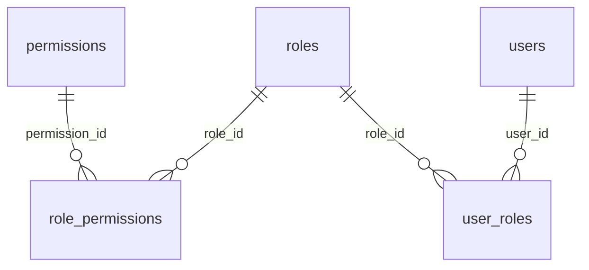

### `schools`

*2 rows / 17 columns*

One customer. The only table without a `school_id` of its own.

**Pointed at by:** `academic_years`, `admission_cycles`, `admission_decisions`, `admission_offers`, `application_guardians`, `application_medical`, `application_payments`, `application_siblings`, `applications`, `assessment_schemes`, `assessment_subjects`, `assessments`, `attendance`, `audit_log`, `class_sections`, `class_subject_teacher`, `custom_fields`, `cycle_class_config`, `departments`, `document_types`, `documents`, `employees`, `enquiries`, `enquiry_interactions`, `enrolments`, `exam_schedule`, `exams`, `fee_concessions`, `fee_heads`, `fee_invoice_lines`, `fee_invoices`, `fee_payments`, `fee_periods`, `fee_plan_items`, `fee_plans`, `grade_bands`, `grading_scales`, `guardians`, `holidays`, `homework`, `homework_submissions`, `interviews`, `jobs`, `leave_balances`, `leave_types`, `marks`, `message_recipients`, `message_templates`, `messages`, `notices`, `notification_preferences`, `number_sequences`, `payment_allocations`, `payroll_runs`, `payslip_lines`, `payslips`, `report_card_publications`, `role_permissions`, `roles`, `route_stops`, `routes`, `salary_components`, `salary_structure_items`, `salary_structures`, `scheme_components`, `school_periods`, `settings`, `staff_attendance`, `staff_leave_requests`, `student_fee_plans`, `student_guardian`, `student_leave_requests`, `students`, `subjects`, `substitutions`, `timetable_slots`, `transport_assignments`, `transport_fee_slabs`, `user_roles`, `users`, `vehicles`, `waitlist_entries`

**Unique on:** `code`

| Column | Type | Null | Notes |
|---|---|---|---|
| `code` | varchar(16) | no | unique |
| `name` | varchar(160) | no | - |
| `status` | varchar(10) | no | default `'active'` |
| `address` | text | yes | - |
| `city` | varchar(80) | yes | - |
| `state` | varchar(80) | yes | - |
| `pincode` | varchar(10) | yes | - |
| `phone` | varchar(20) | yes | - |
| `email` | varchar(160) | yes | - |
| `website` | varchar(200) | yes | - |
| `logo_url` | text | yes | - |
| `primary_color` | varchar(9) | yes | - |
| `board` | varchar(20) | yes | - |
| `affiliation_no` | varchar(40) | yes | - |
| `id` | bigint | no | primary key |
| `created_at` | timestamptz | no | default `now()` |
| `updated_at` | timestamptz | no | default `now()` |

### `academic_years`

*2 rows / 12 columns*

A session. Several may be open at once — 2026-27 active while 2027-28 takes
admissions and 2025-26 is closing is the normal state of a school in January,
which the v0 string could not express.

**Points at:** `schools`

**Pointed at by:** `admission_cycles`, `assessment_schemes`, `audit_log`, `class_sections`, `enrolments`, `fee_invoices`, `fee_plans`, `holidays`, `leave_balances`, `staff_leave_requests`

**Unique on:** `school_id,code`

| Column | Type | Null | Notes |
|---|---|---|---|
| `school_id` | bigint | no | -> `schools.id`, unique |
| `code` | varchar(9) | no | unique |
| `start_date` | date | no | - |
| `end_date` | date | no | - |
| `status` | varchar(15) | no | default `'planning'` |
| `is_current` | boolean | no | default `false` |
| `promotion_completed_at` | date | yes | - |
| `result_published_at` | date | yes | - |
| `closed_at` | date | yes | - |
| `id` | bigint | no | primary key |
| `created_at` | timestamptz | no | default `now()` |
| `updated_at` | timestamptz | no | default `now()` |

### `users`

*216 rows / 12 columns*

Every person who can sign in - staff, students and guardians alike. One row per
login; the role-specific detail lives in `students`, `guardians` or `employees`,
each of which points back here.

**Points at:** `schools`

**Pointed at by:** `admission_decisions`, `application_payments`, `applications`, `assessments`, `audit_log`, `documents`, `employees`, `enquiries`, `enquiry_interactions`, `exam_schedule`, `fee_concessions`, `fee_payments`, `fee_periods`, `guardians`, `interviews`, `marks`, `message_recipients`, `messages`, `notices`, `notification_preferences`, `payroll_runs`, `report_card_publications`, `staff_attendance`, `staff_leave_requests`, `student_fee_plans`, `student_leave_requests`, `students`, `user_roles`

**Unique on:** `school_id,login_id`

| Column | Type | Null | Notes |
|---|---|---|---|
| `role` | varchar(7) | no | - |
| `login_id` | varchar(64) | no | unique |
| `password_hash` | varchar(255) | no | - |
| `full_name` | varchar(120) | no | - |
| `email` | varchar(160) | yes | - |
| `phone` | varchar(20) | yes | - |
| `photo_url` | text | yes | - |
| `is_active` | boolean | no | - |
| `id` | bigint | no | primary key |
| `created_at` | timestamptz | no | default `CURRENT_TIMESTAMP` |
| `updated_at` | timestamptz | no | default `now()` |
| `school_id` | bigint | no | -> `schools.id`, unique |

### `roles`

*28 rows / 8 columns*

A named set of permissions. System roles ship with the product and cannot be
deleted; a school may copy one and adjust it.

**Points at:** `schools`

**Pointed at by:** `role_permissions`, `user_roles`

**Unique on:** `school_id,code`

| Column | Type | Null | Notes |
|---|---|---|---|
| `school_id` | bigint | no | -> `schools.id`, unique |
| `code` | varchar(40) | no | unique |
| `name` | varchar(80) | no | - |
| `description` | text | yes | - |
| `is_system` | boolean | no | default `false` |
| `id` | bigint | no | primary key |
| `created_at` | timestamptz | no | default `now()` |
| `updated_at` | timestamptz | no | default `now()` |

### `permissions`

*77 rows / 7 columns*

A thing that can be done, named `module.resource.action`.

**Pointed at by:** `role_permissions`

**Unique on:** `code`

| Column | Type | Null | Notes |
|---|---|---|---|
| `code` | varchar(80) | no | unique |
| `module` | varchar(40) | no | - |
| `action` | varchar(40) | no | - |
| `description` | text | yes | - |
| `id` | bigint | no | primary key |
| `created_at` | timestamptz | no | default `now()` |
| `updated_at` | timestamptz | no | default `now()` |

### `role_permissions`

*293 rows / 6 columns*

Which permissions a role grants. Per school, so two tenants can define the same
role differently.

**Points at:** `permissions`, `roles`, `schools`

**Unique on:** `role_id,permission_id`

| Column | Type | Null | Notes |
|---|---|---|---|
| `school_id` | bigint | no | -> `schools.id` |
| `role_id` | bigint | no | -> `roles.id`, unique |
| `permission_id` | bigint | no | -> `permissions.id`, unique |
| `id` | bigint | no | primary key |
| `created_at` | timestamptz | no | default `now()` |
| `updated_at` | timestamptz | no | default `now()` |

### `user_roles`

*223 rows / 8 columns*

A user holds a role, optionally narrowed to part of the school.

**Points at:** `roles`, `schools`, `users`

**Unique on:** `user_id,role_id,scope_type,scope_id`

| Column | Type | Null | Notes |
|---|---|---|---|
| `school_id` | bigint | no | -> `schools.id` |
| `user_id` | bigint | no | -> `users.id`, unique |
| `role_id` | bigint | no | -> `roles.id`, unique |
| `scope_type` | varchar(13) | no | unique, default `'school'` |
| `scope_id` | bigint | yes | unique |
| `id` | bigint | no | primary key |
| `created_at` | timestamptz | no | default `now()` |
| `updated_at` | timestamptz | no | default `now()` |

### `settings`

*2 rows / 6 columns*

Per-school configuration as key/value pairs, with the vocabulary defined in
`core/settings_registry.py`. Module switches live here too, as
`feature.<module>`.

**Points at:** `schools`

**Unique on:** `school_id,key`

| Column | Type | Null | Notes |
|---|---|---|---|
| `school_id` | bigint | no | -> `schools.id`, unique |
| `key` | varchar(80) | no | unique |
| `value` | json | no | - |
| `id` | bigint | no | primary key |
| `created_at` | timestamptz | no | default `now()` |
| `updated_at` | timestamptz | no | default `now()` |

### `custom_fields`

*2 rows / 12 columns*

One school-defined attribute on students, guardians, employees or applications
(§3.15 level 2).

**Points at:** `schools`

**Unique on:** `school_id,entity,key`

| Column | Type | Null | Notes |
|---|---|---|---|
| `school_id` | bigint | no | -> `schools.id`, unique |
| `entity` | varchar(11) | no | unique |
| `key` | varchar(40) | no | unique |
| `label` | varchar(120) | no | - |
| `field_type` | varchar(7) | no | - |
| `options` | json | yes | - |
| `is_required` | boolean | no | default `false` |
| `is_active` | boolean | no | default `true` |
| `sort_order` | integer | no | default `100` |
| `id` | bigint | no | primary key |
| `created_at` | timestamptz | no | default `now()` |
| `updated_at` | timestamptz | no | default `now()` |

### `number_sequences`

*3 rows / 9 columns*

A gapless counter per school, per type, per year.

**Points at:** `schools`

**Unique on:** `school_id,kind,year`

| Column | Type | Null | Notes |
|---|---|---|---|
| `school_id` | bigint | no | -> `schools.id`, unique |
| `kind` | varchar(24) | no | unique |
| `year` | integer | no | unique |
| `prefix` | varchar(24) | yes | - |
| `width` | integer | no | default `6` |
| `next_value` | integer | no | default `1` |
| `id` | bigint | no | primary key |
| `created_at` | timestamptz | no | default `now()` |
| `updated_at` | timestamptz | no | default `now()` |

### `alembic_version`

*1 rows / 1 columns*

Alembic's own bookkeeping - the single row naming the migration this database is
at. Not part of the product; never edit it by hand.

_Stands alone: nothing references it and it references nothing._

| Column | Type | Null | Notes |
|---|---|---|---|
| `version_num` | varchar(32) | no | - |

## People - students and guardians

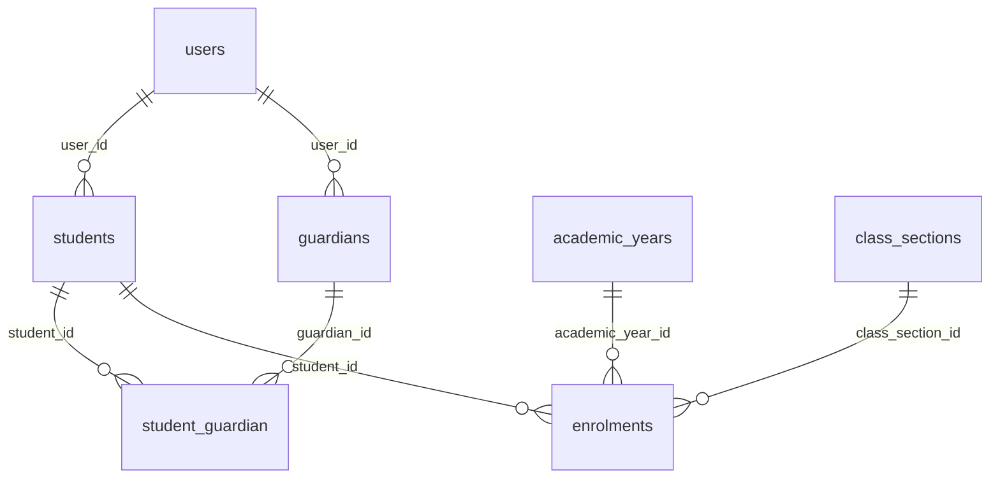

### `students`

*100 rows / 12 columns*

What is true about a student for life. Which class they sit in is a fact about a
*year* and lives on `enrolments` (ERP_BLUEPRINT §3.2).

**Points at:** `schools`, `users`

**Pointed at by:** `application_siblings`, `applications`, `enrolments`, `homework_submissions`, `marks`, `message_recipients`, `student_guardian`

**Unique on:** `user_id`, `school_id,admission_no`

| Column | Type | Null | Notes |
|---|---|---|---|
| `user_id` | bigint | no | -> `users.id`, unique |
| `admission_no` | varchar(32) | no | unique |
| `dob` | date | yes | - |
| `gender` | varchar(6) | yes | - |
| `address` | text | yes | - |
| `admission_date` | date | yes | - |
| `id` | bigint | no | primary key |
| `created_at` | timestamptz | no | default `CURRENT_TIMESTAMP` |
| `updated_at` | timestamptz | no | default `now()` |
| `school_id` | bigint | no | -> `schools.id`, unique |
| `status` | varchar(15) | no | default `'active'` |
| `custom` | json | no | default `'{}'` |

### `guardians`

*98 rows / 7 columns*

Whoever is responsible for a child — not necessarily a parent (§3.4).

**Points at:** `schools`, `users`

**Pointed at by:** `message_recipients`, `student_guardian`

**Unique on:** `user_id`

| Column | Type | Null | Notes |
|---|---|---|---|
| `user_id` | bigint | no | -> `users.id`, unique |
| `occupation` | varchar(80) | yes | - |
| `id` | bigint | no | primary key |
| `created_at` | timestamptz | no | default `CURRENT_TIMESTAMP` |
| `updated_at` | timestamptz | no | default `now()` |
| `school_id` | bigint | no | -> `schools.id` |
| `employee_id` | bigint | yes | - |

### `student_guardian`

*100 rows / 8 columns*

The link, with the structure §3.4 asks for: which relation, and which one of
them the school actually rings.

**Points at:** `guardians`, `schools`, `students`

**Unique on:** `guardian_id,student_id`

| Column | Type | Null | Notes |
|---|---|---|---|
| `guardian_id` | bigint | no | -> `guardians.id`, unique |
| `student_id` | bigint | no | -> `students.id`, unique |
| `relation` | varchar(14) | no | - |
| `id` | bigint | no | primary key |
| `created_at` | timestamptz | no | default `CURRENT_TIMESTAMP` |
| `updated_at` | timestamptz | no | default `now()` |
| `school_id` | bigint | no | -> `schools.id` |
| `is_primary` | boolean | no | default `false` |

### `enrolments`

*100 rows / 12 columns*

A student's membership of a section for one academic year. **The most important
join in the schema**: every year-scoped fact - fees, attendance, marks, a bus
seat - hangs off `enrolment_id`, never `student_id`.

**Points at:** `academic_years`, `class_sections`, `schools`, `students`

**Pointed at by:** `attendance`, `fee_concessions`, `fee_invoices`, `fee_payments`, `report_card_publications`, `student_fee_plans`, `student_leave_requests`, `transport_assignments`

**Unique on:** `class_section_id,roll_no`

| Column | Type | Null | Notes |
|---|---|---|---|
| `school_id` | bigint | no | -> `schools.id` |
| `student_id` | bigint | no | -> `students.id` |
| `academic_year_id` | bigint | no | -> `academic_years.id` |
| `class_section_id` | bigint | no | -> `class_sections.id`, unique |
| `roll_no` | integer | no | unique |
| `status` | varchar(15) | no | default `'active'` |
| `joined_on` | date | yes | - |
| `left_on` | date | yes | - |
| `house` | varchar(20) | yes | - |
| `id` | bigint | no | primary key |
| `created_at` | timestamptz | no | default `now()` |
| `updated_at` | timestamptz | no | default `now()` |

## People - staff

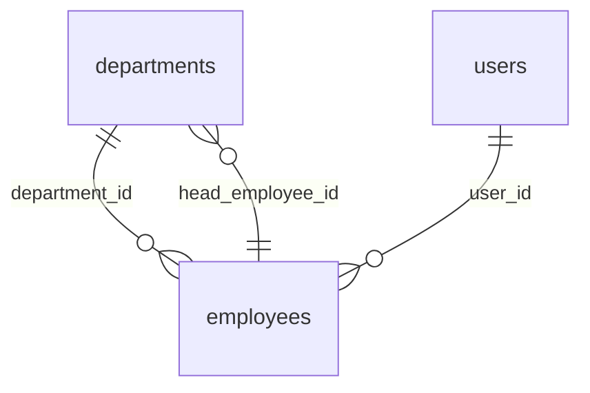

### `employees`

*16 rows / 22 columns*

Any member of staff, teaching or not (ERP_BLUEPRINT §3.4).

**Points at:** `departments`, `employees`, `schools`, `users`

**Pointed at by:** `application_guardians`, `attendance`, `class_sections`, `class_subject_teacher`, `departments`, `homework`, `leave_balances`, `payslips`, `routes`, `salary_structures`, `staff_attendance`, `staff_leave_requests`, `substitutions`, `timetable_slots`

**Unique on:** `user_id`, `school_id,employee_code`

| Column | Type | Null | Notes |
|---|---|---|---|
| `user_id` | bigint | no | -> `users.id`, unique |
| `employee_code` | varchar(16) | no | unique |
| `qualification` | varchar(120) | yes | - |
| `joining_date` | date | yes | - |
| `id` | bigint | no | primary key |
| `created_at` | timestamptz | no | default `CURRENT_TIMESTAMP` |
| `updated_at` | timestamptz | no | default `now()` |
| `school_id` | bigint | no | -> `schools.id`, unique |
| `employee_type` | varchar(14) | no | default `'teaching'` |
| `department_id` | bigint | yes | -> `departments.id` |
| `reporting_to_id` | bigint | yes | -> `employees.id` |
| `status` | varchar(13) | no | default `'active'` |
| `exited_on` | date | yes | - |
| `designation` | varchar(60) | yes | - |
| `emergency_contact_name` | varchar(120) | yes | - |
| `emergency_contact_phone` | varchar(20) | yes | - |
| `pan` | varchar(10) | yes | - |
| `uan` | varchar(12) | yes | - |
| `esi_number` | varchar(20) | yes | - |
| `bank_account_no` | varchar(20) | yes | - |
| `bank_ifsc` | varchar(11) | yes | - |
| `bank_name` | varchar(80) | yes | - |

### `departments`

*6 rows / 7 columns*

A teaching or administrative department (§5.3.3).

**Points at:** `employees`, `schools`

**Pointed at by:** `employees`

**Unique on:** `school_id,code`

| Column | Type | Null | Notes |
|---|---|---|---|
| `id` | bigint | no | primary key |
| `school_id` | bigint | no | -> `schools.id`, unique |
| `code` | varchar(12) | no | unique |
| `name` | varchar(80) | no | - |
| `head_employee_id` | bigint | yes | -> `employees.id` |
| `created_at` | timestamptz | no | default `now()` |
| `updated_at` | timestamptz | no | default `now()` |

## Academics

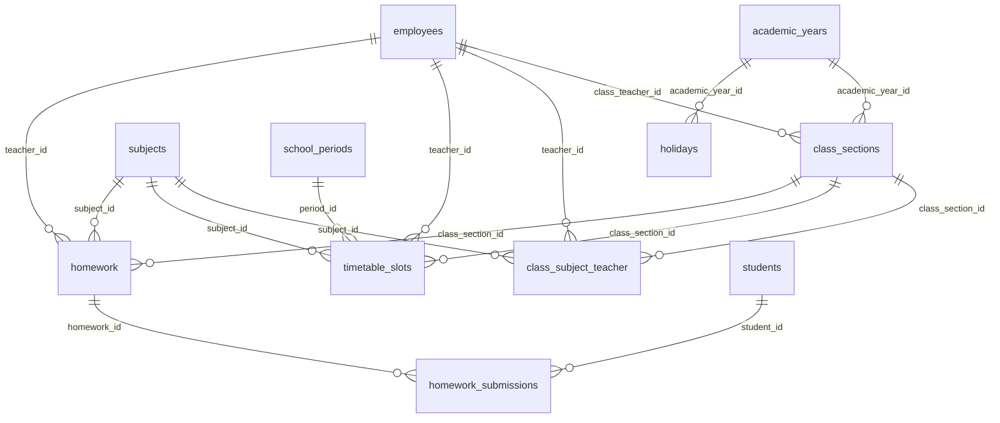

### `class_sections`

*10 rows / 11 columns*

One class-and-section for one academic year - 10-A, 9-B - with its capacity,
room and class teacher. The unit almost everything academic is scoped to.

**Points at:** `academic_years`, `employees`, `schools`

**Pointed at by:** `class_subject_teacher`, `enrolments`, `exam_schedule`, `homework`, `notices`, `timetable_slots`

**Unique on:** `academic_year_id,class_name,section`

| Column | Type | Null | Notes |
|---|---|---|---|
| `class_name` | varchar(8) | no | unique |
| `section` | varchar(4) | no | unique |
| `class_teacher_id` | bigint | yes | -> `employees.id` |
| `id` | bigint | no | primary key |
| `created_at` | timestamptz | no | default `CURRENT_TIMESTAMP` |
| `updated_at` | timestamptz | no | default `now()` |
| `school_id` | bigint | no | -> `schools.id` |
| `academic_year_id` | bigint | no | -> `academic_years.id`, unique |
| `capacity` | integer | yes | - |
| `stream` | varchar(20) | yes | - |
| `room` | varchar(20) | yes | - |

### `subjects`

*9 rows / 6 columns*

The catalogue of subjects the school teaches. A subject exists once and is
attached to sections through `class_subject_teacher`.

**Points at:** `schools`

**Pointed at by:** `class_subject_teacher`, `exam_schedule`, `homework`, `timetable_slots`

**Unique on:** `school_id,code`

| Column | Type | Null | Notes |
|---|---|---|---|
| `name` | varchar(60) | no | - |
| `code` | varchar(12) | no | unique |
| `id` | bigint | no | primary key |
| `created_at` | timestamptz | no | default `CURRENT_TIMESTAMP` |
| `updated_at` | timestamptz | no | default `now()` |
| `school_id` | bigint | no | -> `schools.id`, unique |

### `class_subject_teacher`

*60 rows / 7 columns*

Which teacher teaches which subject to which section. The join that makes a
timetable solvable and decides whose marks entry is allowed.

**Points at:** `class_sections`, `employees`, `schools`, `subjects`

**Unique on:** `class_section_id,subject_id`

| Column | Type | Null | Notes |
|---|---|---|---|
| `class_section_id` | bigint | no | -> `class_sections.id`, unique |
| `subject_id` | bigint | no | -> `subjects.id`, unique |
| `teacher_id` | bigint | no | -> `employees.id` |
| `id` | bigint | no | primary key |
| `created_at` | timestamptz | no | default `CURRENT_TIMESTAMP` |
| `updated_at` | timestamptz | no | default `now()` |
| `school_id` | bigint | no | -> `schools.id` |

### `school_periods`

*6 rows / 9 columns*

Bell timings, once per school instead of once per slot.

**Points at:** `schools`

**Pointed at by:** `timetable_slots`

**Unique on:** `school_id,period_no`

| Column | Type | Null | Notes |
|---|---|---|---|
| `id` | bigint | no | primary key |
| `school_id` | bigint | no | -> `schools.id`, unique |
| `period_no` | integer | no | unique |
| `start_time` | time without time zone | no | - |
| `end_time` | time without time zone | no | - |
| `name` | varchar(20) | yes | - |
| `is_break` | boolean | no | default `false` |
| `created_at` | timestamptz | no | default `now()` |
| `updated_at` | timestamptz | no | default `now()` |

### `timetable_slots`

*300 rows / 10 columns*

The weekly grid. Which subject, taught by which teacher, occupies which period
on which weekday for which section.

**Points at:** `class_sections`, `employees`, `school_periods`, `schools`, `subjects`

**Pointed at by:** `substitutions`

**Unique on:** `class_section_id,day_of_week,period_id`

| Column | Type | Null | Notes |
|---|---|---|---|
| `id` | bigint | no | primary key |
| `school_id` | bigint | no | -> `schools.id` |
| `class_section_id` | bigint | no | -> `class_sections.id`, unique |
| `day_of_week` | varchar(3) | no | unique |
| `period_id` | bigint | no | -> `school_periods.id`, unique |
| `subject_id` | bigint | no | -> `subjects.id` |
| `teacher_id` | bigint | no | -> `employees.id` |
| `room` | varchar(20) | yes | - |
| `created_at` | timestamptz | no | default `now()` |
| `updated_at` | timestamptz | no | default `now()` |

### `holidays`

*5 rows / 7 columns*

A day the school is shut.

**Points at:** `academic_years`, `schools`

**Unique on:** `academic_year_id,date`

| Column | Type | Null | Notes |
|---|---|---|---|
| `id` | bigint | no | primary key |
| `school_id` | bigint | no | -> `schools.id` |
| `academic_year_id` | bigint | no | -> `academic_years.id`, unique |
| `date` | date | no | unique |
| `name` | varchar(80) | no | - |
| `created_at` | timestamptz | no | default `now()` |
| `updated_at` | timestamptz | no | default `now()` |

### `homework`

*8 rows / 11 columns*

A piece of homework set for a section and subject, with the date it is due.

**Points at:** `class_sections`, `employees`, `schools`, `subjects`

**Pointed at by:** `homework_submissions`

| Column | Type | Null | Notes |
|---|---|---|---|
| `class_section_id` | bigint | no | -> `class_sections.id` |
| `subject_id` | bigint | no | -> `subjects.id` |
| `teacher_id` | bigint | no | -> `employees.id` |
| `title` | varchar(160) | no | - |
| `description` | text | yes | - |
| `assigned_date` | date | no | - |
| `due_date` | date | no | - |
| `id` | bigint | no | primary key |
| `created_at` | timestamptz | no | default `CURRENT_TIMESTAMP` |
| `updated_at` | timestamptz | no | default `now()` |
| `school_id` | bigint | no | -> `schools.id` |

### `homework_submissions`

*47 rows / 8 columns*

A child's submission against one `homework` row, and whether it has been marked.

**Points at:** `homework`, `schools`, `students`

**Unique on:** `homework_id,student_id`

| Column | Type | Null | Notes |
|---|---|---|---|
| `homework_id` | bigint | no | -> `homework.id`, unique |
| `student_id` | bigint | no | -> `students.id`, unique |
| `answer_text` | text | no | - |
| `submitted_at` | timestamptz | no | - |
| `id` | bigint | no | primary key |
| `created_at` | timestamptz | no | default `CURRENT_TIMESTAMP` |
| `updated_at` | timestamptz | no | default `now()` |
| `school_id` | bigint | no | -> `schools.id` |

## Attendance

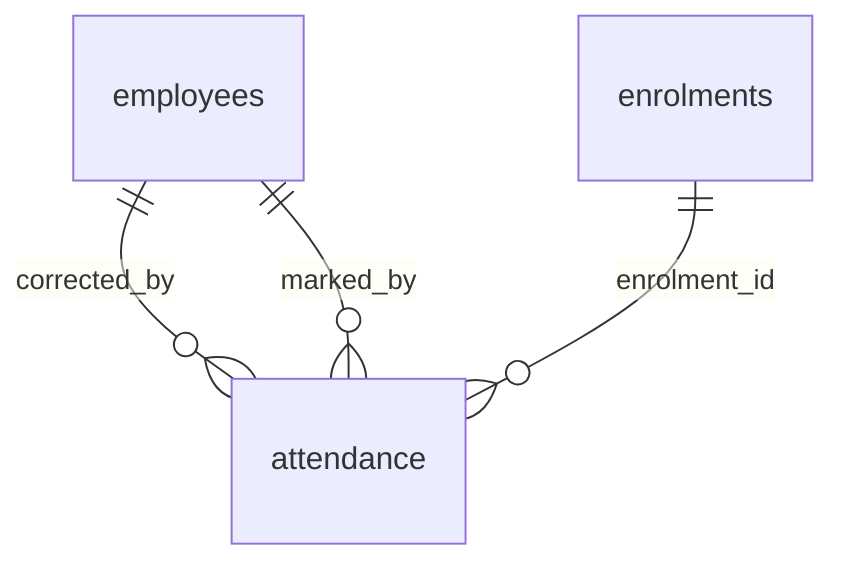

### `attendance`

*5,800 rows / 11 columns*

One day, one child, one mark.

**Points at:** `employees`, `enrolments`, `schools`

**Unique on:** `enrolment_id,date`

| Column | Type | Null | Notes |
|---|---|---|---|
| `id` | bigint | no | primary key |
| `school_id` | bigint | no | -> `schools.id` |
| `enrolment_id` | bigint | no | -> `enrolments.id`, unique |
| `date` | date | no | unique |
| `status` | varchar(8) | no | - |
| `marked_by` | bigint | yes | -> `employees.id` |
| `remarks` | varchar(200) | yes | - |
| `corrected_by` | bigint | yes | -> `employees.id` |
| `corrected_at` | timestamptz | yes | - |
| `created_at` | timestamptz | no | default `now()` |
| `updated_at` | timestamptz | no | default `now()` |

## Examinations and results

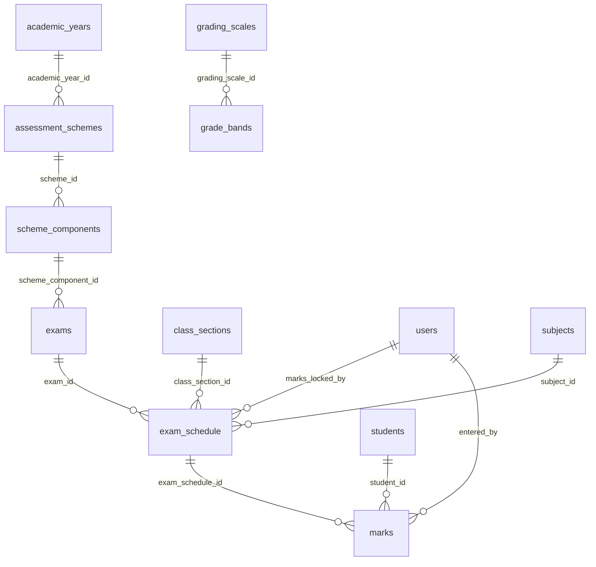

### `exams`

*4 rows / 9 columns*

One assessment event: "Term 1 Periodic Test", "Term 1 Examination".

**Points at:** `scheme_components`, `schools`

**Pointed at by:** `exam_schedule`

| Column | Type | Null | Notes |
|---|---|---|---|
| `name` | varchar(120) | no | - |
| `term` | varchar(20) | no | - |
| `start_date` | date | no | - |
| `end_date` | date | no | - |
| `id` | bigint | no | primary key |
| `created_at` | timestamptz | no | default `CURRENT_TIMESTAMP` |
| `updated_at` | timestamptz | no | default `now()` |
| `school_id` | bigint | no | -> `schools.id` |
| `scheme_component_id` | bigint | yes | -> `scheme_components.id` |

### `exam_schedule`

*240 rows / 13 columns*

One paper: this exam, this section, this subject.

**Points at:** `class_sections`, `exams`, `schools`, `subjects`, `users`

**Pointed at by:** `marks`

**Unique on:** `exam_id,class_section_id,subject_id`

| Column | Type | Null | Notes |
|---|---|---|---|
| `exam_id` | bigint | no | -> `exams.id`, unique |
| `class_section_id` | bigint | no | -> `class_sections.id`, unique |
| `subject_id` | bigint | no | -> `subjects.id`, unique |
| `exam_date` | date | no | - |
| `start_time` | time without time zone | yes | - |
| `max_marks` | numeric(5,2) | no | - |
| `id` | bigint | no | primary key |
| `created_at` | timestamptz | no | default `CURRENT_TIMESTAMP` |
| `updated_at` | timestamptz | no | default `now()` |
| `school_id` | bigint | no | -> `schools.id` |
| `room` | varchar(20) | yes | - |
| `marks_locked_at` | timestamptz | yes | - |
| `marks_locked_by` | bigint | yes | -> `users.id` |

### `marks`

*2,400 rows / 11 columns*

One child's result on one paper.

**Points at:** `exam_schedule`, `schools`, `students`, `users`

**Unique on:** `exam_schedule_id,student_id`

| Column | Type | Null | Notes |
|---|---|---|---|
| `exam_schedule_id` | bigint | no | -> `exam_schedule.id`, unique |
| `student_id` | bigint | no | -> `students.id`, unique |
| `marks_obtained` | numeric(5,2) | yes | - |
| `entered_by` | bigint | no | -> `users.id` |
| `id` | bigint | no | primary key |
| `created_at` | timestamptz | no | default `CURRENT_TIMESTAMP` |
| `updated_at` | timestamptz | no | default `now()` |
| `school_id` | bigint | no | -> `schools.id` |
| `is_absent` | boolean | no | default `false` |
| `is_exempted` | boolean | no | default `false` |
| `remarks` | varchar(200) | yes | - |

### `assessment_schemes`

*1 rows / 7 columns*

The shape of a year's assessment: its terms and what each is marked out of
(§5.4.3).

**Points at:** `academic_years`, `schools`

**Pointed at by:** `report_card_publications`, `scheme_components`

**Unique on:** `academic_year_id,name`

| Column | Type | Null | Notes |
|---|---|---|---|
| `id` | bigint | no | primary key |
| `school_id` | bigint | no | -> `schools.id` |
| `academic_year_id` | bigint | no | -> `academic_years.id`, unique |
| `name` | varchar(80) | no | unique |
| `is_active` | boolean | no | default `false` |
| `created_at` | timestamptz | no | default `now()` |
| `updated_at` | timestamptz | no | default `now()` |

### `scheme_components`

*8 rows / 10 columns*

One markable column of the report card: "Term 1, Periodic Test, out of 10".

**Points at:** `assessment_schemes`, `schools`

**Pointed at by:** `exams`

**Unique on:** `scheme_id,term,code`

| Column | Type | Null | Notes |
|---|---|---|---|
| `id` | bigint | no | primary key |
| `school_id` | bigint | no | -> `schools.id` |
| `scheme_id` | bigint | no | -> `assessment_schemes.id`, unique |
| `term` | varchar(20) | no | unique |
| `code` | varchar(12) | no | unique |
| `name` | varchar(60) | no | - |
| `max_marks` | numeric(5,2) | no | - |
| `sequence` | integer | no | default `0` |
| `created_at` | timestamptz | no | default `now()` |
| `updated_at` | timestamptz | no | default `now()` |

### `grading_scales`

*1 rows / 8 columns*

A named set of grade bands, versioned.

**Points at:** `schools`

**Pointed at by:** `grade_bands`, `report_card_publications`

**Unique on:** `school_id,name,version`

| Column | Type | Null | Notes |
|---|---|---|---|
| `id` | bigint | no | primary key |
| `school_id` | bigint | no | -> `schools.id`, unique |
| `name` | varchar(60) | no | unique |
| `version` | integer | no | unique, default `1` |
| `is_active` | boolean | no | default `false` |
| `frozen_at` | timestamptz | yes | - |
| `created_at` | timestamptz | no | default `now()` |
| `updated_at` | timestamptz | no | default `now()` |

### `grade_bands`

*8 rows / 8 columns*

One row of a grading scale: "91 and above is an A1".

**Points at:** `grading_scales`, `schools`

**Unique on:** `grading_scale_id,min_percent`, `grading_scale_id,grade`

| Column | Type | Null | Notes |
|---|---|---|---|
| `min_percent` | numeric(5,2) | no | unique |
| `grade` | varchar(4) | no | unique |
| `id` | bigint | no | primary key |
| `created_at` | timestamptz | no | default `CURRENT_TIMESTAMP` |
| `updated_at` | timestamptz | no | default `now()` |
| `school_id` | bigint | no | -> `schools.id` |
| `grading_scale_id` | bigint | no | -> `grading_scales.id`, unique |
| `description` | varchar(40) | yes | - |

## Fees and money

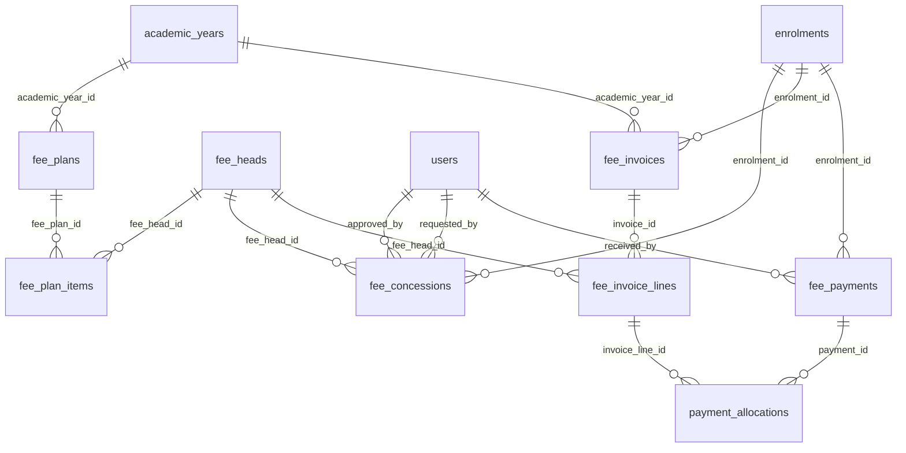

### `fee_heads`

*5 rows / 10 columns*

The named charges a school bills: tuition, transport, exam fee. The vocabulary
every invoice line is built from.

**Points at:** `schools`

**Pointed at by:** `fee_concessions`, `fee_invoice_lines`, `fee_plan_items`

**Unique on:** `school_id,code`

| Column | Type | Null | Notes |
|---|---|---|---|
| `id` | bigint | no | primary key |
| `school_id` | bigint | no | -> `schools.id`, unique |
| `name` | varchar(60) | no | - |
| `code` | varchar(16) | no | unique |
| `type` | varchar(9) | no | - |
| `is_refundable` | boolean | no | default `false` |
| `gl_code` | varchar(20) | yes | - |
| `is_active` | boolean | no | default `true` |
| `created_at` | timestamptz | no | default `now()` |
| `updated_at` | timestamptz | no | default `now()` |

### `fee_plans`

*10 rows / 8 columns*

What a class is charged for a year.

**Points at:** `academic_years`, `schools`

**Pointed at by:** `fee_plan_items`, `student_fee_plans`

**Unique on:** `academic_year_id,name`

| Column | Type | Null | Notes |
|---|---|---|---|
| `id` | bigint | no | primary key |
| `school_id` | bigint | no | -> `schools.id` |
| `academic_year_id` | bigint | no | -> `academic_years.id`, unique |
| `name` | varchar(60) | no | unique |
| `class_name` | varchar(8) | yes | - |
| `is_active` | boolean | no | default `true` |
| `created_at` | timestamptz | no | default `now()` |
| `updated_at` | timestamptz | no | default `now()` |

### `fee_plan_items`

*30 rows / 8 columns*

The lines of a fee plan - which head, how much, how often. A plan means nothing
without these.

**Points at:** `fee_heads`, `fee_plans`, `schools`

**Unique on:** `fee_plan_id,fee_head_id`

| Column | Type | Null | Notes |
|---|---|---|---|
| `id` | bigint | no | primary key |
| `school_id` | bigint | no | -> `schools.id` |
| `fee_plan_id` | bigint | no | -> `fee_plans.id`, unique |
| `fee_head_id` | bigint | no | -> `fee_heads.id`, unique |
| `amount` | numeric(10,2) | no | - |
| `frequency` | varchar(8) | no | - |
| `created_at` | timestamptz | no | default `now()` |
| `updated_at` | timestamptz | no | default `now()` |

### `fee_concessions`

*2 rows / 16 columns*

A discount that someone approved.

**Points at:** `enrolments`, `fee_heads`, `schools`, `users`

| Column | Type | Null | Notes |
|---|---|---|---|
| `id` | bigint | no | primary key |
| `school_id` | bigint | no | -> `schools.id` |
| `enrolment_id` | bigint | no | -> `enrolments.id` |
| `type` | varchar(11) | no | - |
| `fee_head_id` | bigint | yes | -> `fee_heads.id` |
| `percent` | numeric(5,2) | yes | - |
| `amount` | numeric(10,2) | yes | - |
| `reason` | text | no | - |
| `status` | varchar(9) | no | - |
| `requested_by` | bigint | yes | -> `users.id` |
| `approved_by` | bigint | yes | -> `users.id` |
| `decided_at` | timestamptz | yes | - |
| `valid_from` | date | yes | - |
| `valid_to` | date | yes | - |
| `created_at` | timestamptz | no | default `now()` |
| `updated_at` | timestamptz | no | default `now()` |

### `fee_invoices`

*300 rows / 14 columns*

One month's bill for one enrolment (§0.6: monthly, per student).

**Points at:** `academic_years`, `enrolments`, `schools`

**Pointed at by:** `fee_invoice_lines`

**Unique on:** `school_id,invoice_no`

| Column | Type | Null | Notes |
|---|---|---|---|
| `id` | bigint | no | primary key |
| `school_id` | bigint | no | -> `schools.id`, unique |
| `enrolment_id` | bigint | no | -> `enrolments.id` |
| `academic_year_id` | bigint | no | -> `academic_years.id` |
| `invoice_no` | varchar(24) | no | unique |
| `period_month` | integer | no | - |
| `period_year` | integer | no | - |
| `issued_on` | date | no | - |
| `due_date` | date | no | - |
| `status` | varchar(14) | no | - |
| `settled_on` | date | yes | - |
| `void_reason` | text | yes | - |
| `created_at` | timestamptz | no | default `now()` |
| `updated_at` | timestamptz | no | default `now()` |

### `fee_invoice_lines`

*900 rows / 9 columns*

One head on one invoice. The unit a payment allocates against.

**Points at:** `fee_heads`, `fee_invoices`, `schools`

**Pointed at by:** `payment_allocations`

| Column | Type | Null | Notes |
|---|---|---|---|
| `id` | bigint | no | primary key |
| `school_id` | bigint | no | -> `schools.id` |
| `invoice_id` | bigint | no | -> `fee_invoices.id` |
| `fee_head_id` | bigint | no | -> `fee_heads.id` |
| `description` | varchar(80) | no | - |
| `amount` | numeric(10,2) | no | - |
| `discount` | numeric(10,2) | no | default `'0'` |
| `created_at` | timestamptz | no | default `now()` |
| `updated_at` | timestamptz | no | default `now()` |

### `fee_payments`

*170 rows / 15 columns*

Money received. Against an enrolment, not against an invoice.

**Points at:** `enrolments`, `fee_payments`, `schools`, `users`

**Pointed at by:** `payment_allocations`

**Unique on:** `school_id,idempotency_key`, `school_id,receipt_no`

| Column | Type | Null | Notes |
|---|---|---|---|
| `id` | bigint | no | primary key |
| `school_id` | bigint | no | -> `schools.id`, unique |
| `enrolment_id` | bigint | no | -> `enrolments.id` |
| `receipt_no` | varchar(24) | no | unique |
| `amount` | numeric(10,2) | no | - |
| `method` | varchar(20) | no | - |
| `instrument_ref` | varchar(40) | yes | - |
| `received_at` | timestamptz | no | - |
| `received_by` | bigint | yes | -> `users.id` |
| `idempotency_key` | varchar(64) | no | unique |
| `status` | varchar(8) | no | - |
| `reverses_payment_id` | bigint | yes | -> `fee_payments.id` |
| `reason` | text | yes | - |
| `created_at` | timestamptz | no | default `now()` |
| `updated_at` | timestamptz | no | default `now()` |

### `payment_allocations`

*450 rows / 7 columns*

How much of a payment settled which line. The ledger's only truth about what is
paid — every balance in the system is a SUM over this table.

**Points at:** `fee_invoice_lines`, `fee_payments`, `schools`

| Column | Type | Null | Notes |
|---|---|---|---|
| `id` | bigint | no | primary key |
| `school_id` | bigint | no | -> `schools.id` |
| `payment_id` | bigint | no | -> `fee_payments.id` |
| `invoice_line_id` | bigint | no | -> `fee_invoice_lines.id` |
| `amount` | numeric(10,2) | no | - |
| `created_at` | timestamptz | no | default `now()` |
| `updated_at` | timestamptz | no | default `now()` |

## Transport

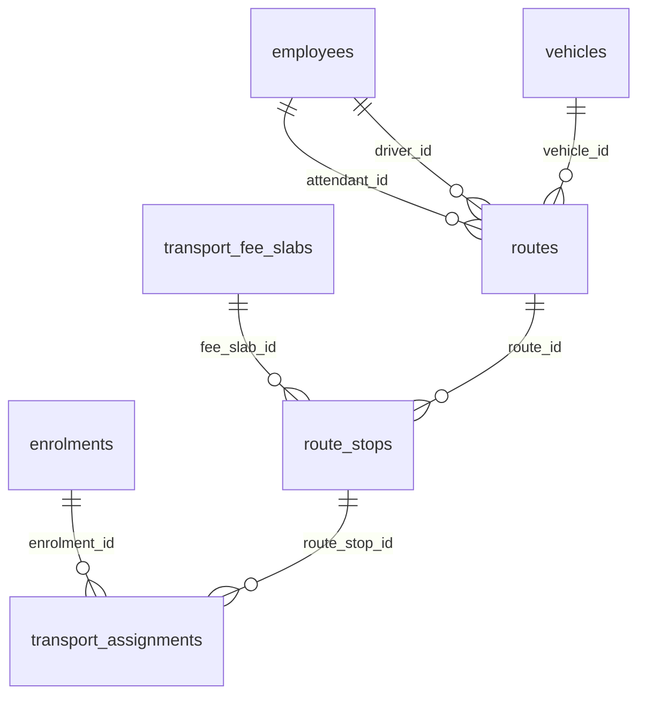

### `vehicles`

*2 rows / 10 columns*

A bus. `capacity` is the seating figure on the registration papers, and it is
the number the hard block in §5.6.9 counts against — not a soft target the
office can talk its way past.

**Points at:** `schools`

**Pointed at by:** `routes`

**Unique on:** `school_id,registration_no`

| Column | Type | Null | Notes |
|---|---|---|---|
| `id` | bigint | no | primary key |
| `school_id` | bigint | no | -> `schools.id`, unique |
| `registration_no` | varchar(20) | no | unique |
| `make_model` | varchar(60) | yes | - |
| `capacity` | integer | no | - |
| `ownership` | varchar(5) | no | default `'owned'` |
| `status` | varchar(17) | no | default `'active'` |
| `gps_device_id` | varchar(40) | yes | - |
| `created_at` | timestamptz | no | default `now()` |
| `updated_at` | timestamptz | no | default `now()` |

### `routes`

*2 rows / 11 columns*

One bus doing one circuit.

**Points at:** `employees`, `schools`, `vehicles`

**Pointed at by:** `route_stops`

**Unique on:** `school_id,code`

| Column | Type | Null | Notes |
|---|---|---|---|
| `id` | bigint | no | primary key |
| `school_id` | bigint | no | -> `schools.id`, unique |
| `code` | varchar(16) | no | unique |
| `name` | varchar(80) | no | - |
| `vehicle_id` | bigint | yes | -> `vehicles.id` |
| `driver_id` | bigint | yes | -> `employees.id` |
| `attendant_id` | bigint | yes | -> `employees.id` |
| `distance_km` | numeric(6,2) | yes | - |
| `status` | varchar(9) | no | default `'planned'` |
| `created_at` | timestamptz | no | default `now()` |
| `updated_at` | timestamptz | no | default `now()` |

### `route_stops`

*7 rows / 13 columns*

A halt on a route, with the times the bus is actually there.

**Points at:** `routes`, `schools`, `transport_fee_slabs`

**Pointed at by:** `transport_assignments`

**Unique on:** `route_id,sequence`

| Column | Type | Null | Notes |
|---|---|---|---|
| `id` | bigint | no | primary key |
| `school_id` | bigint | no | -> `schools.id` |
| `route_id` | bigint | no | -> `routes.id`, unique |
| `sequence` | integer | no | unique |
| `name` | varchar(80) | no | - |
| `landmark` | varchar(120) | yes | - |
| `pickup_time` | time without time zone | no | - |
| `drop_time` | time without time zone | yes | - |
| `fee_slab_id` | bigint | yes | -> `transport_fee_slabs.id` |
| `created_at` | timestamptz | no | default `now()` |
| `updated_at` | timestamptz | no | default `now()` |
| `latitude` | float | yes | - |
| `longitude` | float | yes | - |

### `transport_assignments`

*30 rows / 11 columns*

A child on a bus, from a date until a date.

**Points at:** `enrolments`, `route_stops`, `schools`

| Column | Type | Null | Notes |
|---|---|---|---|
| `id` | bigint | no | primary key |
| `school_id` | bigint | no | -> `schools.id` |
| `enrolment_id` | bigint | no | -> `enrolments.id` |
| `route_stop_id` | bigint | no | -> `route_stops.id` |
| `direction` | varchar(6) | no | default `'both'` |
| `start_date` | date | no | - |
| `end_date` | date | yes | - |
| `status` | varchar(9) | no | default `'requested'` |
| `end_reason` | text | yes | - |
| `created_at` | timestamptz | no | default `now()` |
| `updated_at` | timestamptz | no | default `now()` |

### `transport_fee_slabs`

*3 rows / 7 columns*

A distance band and its monthly price.

**Points at:** `schools`

**Pointed at by:** `route_stops`

**Unique on:** `school_id,name`

| Column | Type | Null | Notes |
|---|---|---|---|
| `id` | bigint | no | primary key |
| `school_id` | bigint | no | -> `schools.id`, unique |
| `name` | varchar(40) | no | unique |
| `monthly_amount` | numeric(10,2) | no | - |
| `is_active` | boolean | no | default `true` |
| `created_at` | timestamptz | no | default `now()` |
| `updated_at` | timestamptz | no | default `now()` |

## HR and payroll

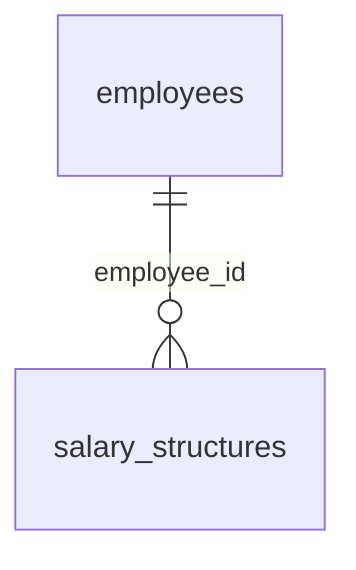

### `leave_types`

*4 rows / 9 columns*

One kind of staff leave, with its yearly entitlement.

**Points at:** `schools`

**Pointed at by:** `leave_balances`, `staff_leave_requests`

**Unique on:** `school_id,code`

| Column | Type | Null | Notes |
|---|---|---|---|
| `id` | bigint | no | primary key |
| `school_id` | bigint | no | -> `schools.id`, unique |
| `code` | varchar(12) | no | unique |
| `name` | varchar(60) | no | - |
| `annual_quota` | numeric(5,1) | no | - |
| `is_paid` | boolean | no | default `true` |
| `active` | boolean | no | default `true` |
| `created_at` | timestamptz | no | default `now()` |
| `updated_at` | timestamptz | no | default `now()` |

### `salary_components`

*11 rows / 14 columns*

One line a payslip can carry, and how its amount is worked out.

**Points at:** `schools`

**Pointed at by:** `payslip_lines`, `salary_structure_items`

**Unique on:** `school_id,code`

| Column | Type | Null | Notes |
|---|---|---|---|
| `id` | bigint | no | primary key |
| `school_id` | bigint | no | -> `schools.id`, unique |
| `code` | varchar(16) | no | unique |
| `name` | varchar(60) | no | - |
| `type` | varchar(21) | no | - |
| `calculation` | varchar(16) | no | - |
| `value` | numeric(12,2) | no | default `'0'` |
| `applies_below_gross` | numeric(12,2) | yes | - |
| `taxable` | boolean | no | default `true` |
| `statutory` | boolean | no | default `false` |
| `active` | boolean | no | default `true` |
| `sequence` | integer | no | default `0` |
| `created_at` | timestamptz | no | default `now()` |
| `updated_at` | timestamptz | no | default `now()` |

### `salary_structures`

*16 rows / 9 columns*

What one employee is on, from a date.

**Points at:** `employees`, `schools`

**Pointed at by:** `salary_structure_items`

**Unique on:** `employee_id,effective_from`

| Column | Type | Null | Notes |
|---|---|---|---|
| `id` | bigint | no | primary key |
| `school_id` | bigint | no | -> `schools.id` |
| `employee_id` | bigint | no | -> `employees.id`, unique |
| `effective_from` | date | no | unique |
| `monthly_gross` | numeric(12,2) | no | - |
| `is_active` | boolean | no | default `false` |
| `note` | text | yes | - |
| `created_at` | timestamptz | no | default `now()` |
| `updated_at` | timestamptz | no | default `now()` |

## Admission

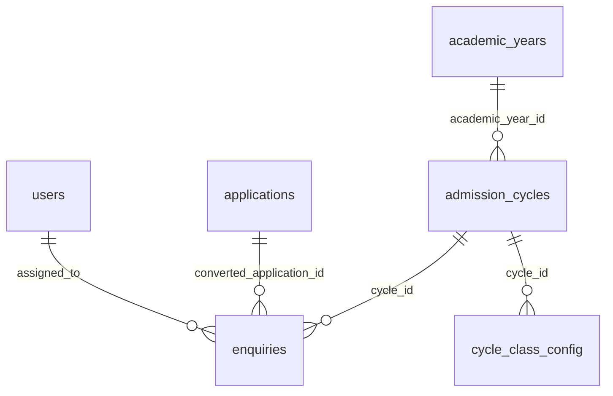

### `enquiries`

*6 rows / 16 columns*

A prospective parent's enquiry, before any application exists. The top of the
admission funnel.

**Points at:** `admission_cycles`, `applications`, `schools`, `users`

**Pointed at by:** `enquiry_interactions`

| Column | Type | Null | Notes |
|---|---|---|---|
| `school_id` | bigint | no | -> `schools.id` |
| `cycle_id` | bigint | no | -> `admission_cycles.id` |
| `enquirer_name` | varchar(120) | no | - |
| `mobile` | varchar(20) | no | - |
| `email` | varchar(160) | yes | - |
| `child_name` | varchar(120) | yes | - |
| `child_dob` | date | yes | - |
| `class_of_interest` | varchar(8) | yes | - |
| `source` | varchar(10) | no | default `'walk_in'` |
| `status` | varchar(23) | no | default `'new'` |
| `assigned_to` | bigint | yes | -> `users.id` |
| `next_follow_up_on` | date | yes | - |
| `converted_application_id` | bigint | yes | -> `applications.id` |
| `id` | bigint | no | primary key |
| `created_at` | timestamptz | no | default `now()` |
| `updated_at` | timestamptz | no | default `now()` |

### `admission_cycles`

*1 rows / 13 columns*

One intake season for one academic year.

**Points at:** `academic_years`, `schools`

**Pointed at by:** `applications`, `cycle_class_config`, `enquiries`, `waitlist_entries`

**Unique on:** `school_id,academic_year_id,name`

| Column | Type | Null | Notes |
|---|---|---|---|
| `school_id` | bigint | no | -> `schools.id`, unique |
| `academic_year_id` | bigint | no | -> `academic_years.id`, unique |
| `name` | varchar(80) | no | unique |
| `status` | varchar(8) | no | default `'planning'` |
| `starts_on` | date | yes | - |
| `ends_on` | date | yes | - |
| `application_fee` | numeric(10,2) | no | default `'0'` |
| `late_fee` | numeric(10,2) | no | default `'0'` |
| `allow_online_applications` | boolean | no | default `true` |
| `admission_fee_refund_policy` | text | yes | - |
| `id` | bigint | no | primary key |
| `created_at` | timestamptz | no | default `now()` |
| `updated_at` | timestamptz | no | default `now()` |

### `cycle_class_config`

*3 rows / 15 columns*

Seats and rules for one class within one cycle.

**Points at:** `admission_cycles`, `schools`

**Unique on:** `cycle_id,class_name,stream`

| Column | Type | Null | Notes |
|---|---|---|---|
| `school_id` | bigint | no | -> `schools.id` |
| `cycle_id` | bigint | no | -> `admission_cycles.id`, unique |
| `class_name` | varchar(8) | no | unique |
| `stream` | varchar(20) | yes | unique |
| `total_seats` | integer | no | default `0` |
| `reserved_seats` | json | yes | - |
| `age_on` | date | yes | - |
| `min_age_years` | numeric(4,2) | yes | - |
| `max_age_years` | numeric(4,2) | yes | - |
| `requires_test` | boolean | no | default `false` |
| `requires_interview` | boolean | no | default `false` |
| `required_document_codes` | json | yes | - |
| `id` | bigint | no | primary key |
| `created_at` | timestamptz | no | default `now()` |
| `updated_at` | timestamptz | no | default `now()` |

## Communication

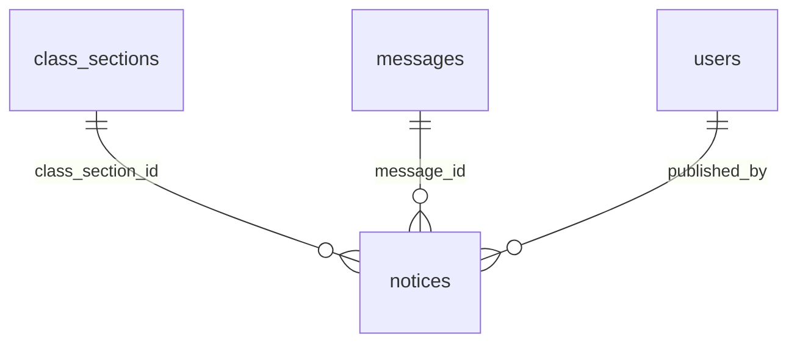

### `notices`

*6 rows / 11 columns*

The noticeboard. An announcement with an audience - the whole school, one class,
parents, teachers - optionally also sent as a message.

**Points at:** `class_sections`, `messages`, `schools`, `users`

| Column | Type | Null | Notes |
|---|---|---|---|
| `title` | varchar(160) | no | - |
| `body` | text | no | - |
| `audience` | varchar(8) | no | - |
| `class_section_id` | bigint | yes | -> `class_sections.id` |
| `published_by` | bigint | no | -> `users.id` |
| `published_at` | timestamptz | no | - |
| `id` | bigint | no | primary key |
| `created_at` | timestamptz | no | default `CURRENT_TIMESTAMP` |
| `updated_at` | timestamptz | no | default `now()` |
| `school_id` | bigint | no | -> `schools.id` |
| `message_id` | bigint | yes | -> `messages.id` |

### `message_templates`

*4 rows / 12 columns*

Versioned, so the exact text sent stays reproducible (§5.9.9).

**Points at:** `schools`

**Pointed at by:** `messages`

**Unique on:** `school_id,code,version`

| Column | Type | Null | Notes |
|---|---|---|---|
| `id` | bigint | no | primary key |
| `school_id` | bigint | no | -> `schools.id`, unique |
| `code` | varchar(40) | no | unique |
| `version` | integer | no | unique, default `1` |
| `name` | varchar(80) | no | - |
| `channel` | varchar(8) | no | default `'email'` |
| `category` | varchar(11) | no | - |
| `subject` | varchar(200) | no | - |
| `body` | text | no | - |
| `is_active` | boolean | no | default `true` |
| `created_at` | timestamptz | no | default `now()` |
| `updated_at` | timestamptz | no | default `now()` |

## System

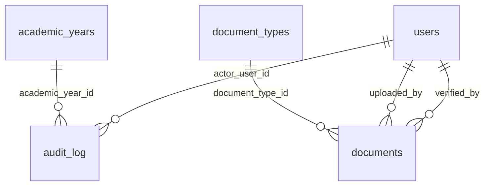

### `audit_log`

*264 rows / 15 columns*

Append-only. No update path, no delete path, never truncated.

**Points at:** `academic_years`, `schools`, `users`

| Column | Type | Null | Notes |
|---|---|---|---|
| `school_id` | bigint | no | -> `schools.id` |
| `occurred_at` | timestamptz | no | - |
| `actor_user_id` | bigint | yes | -> `users.id` |
| `actor_label` | varchar(120) | yes | - |
| `entity_type` | varchar(40) | no | - |
| `entity_id` | bigint | yes | - |
| `action` | varchar(13) | no | - |
| `before` | json | yes | - |
| `after` | json | yes | - |
| `reason` | text | yes | - |
| `academic_year_id` | bigint | yes | -> `academic_years.id` |
| `ip` | varchar(45) | yes | - |
| `id` | bigint | no | primary key |
| `created_at` | timestamptz | no | default `now()` |
| `updated_at` | timestamptz | no | default `now()` |

### `documents`

*13 rows / 24 columns*

An uploaded file attached to a student, an employee or a vehicle, with its
verification state and expiry. Deleted softly, so the audit entry still points
at something.

**Points at:** `document_types`, `schools`, `users`

**Unique on:** `file_key`

| Column | Type | Null | Notes |
|---|---|---|---|
| `school_id` | bigint | no | -> `schools.id` |
| `owner_type` | varchar(11) | no | - |
| `owner_id` | bigint | no | - |
| `document_type_id` | bigint | yes | -> `document_types.id` |
| `file_key` | varchar(255) | no | unique |
| `file_name` | varchar(255) | no | - |
| `mime_type` | varchar(120) | no | - |
| `size_bytes` | bigint | no | - |
| `checksum` | varchar(64) | yes | - |
| `uploaded_by` | bigint | yes | -> `users.id` |
| `uploaded_at` | timestamptz | no | - |
| `status` | varchar(17) | no | default `'pending'` |
| `original_seen` | boolean | no | default `false` |
| `verified_by` | bigint | yes | -> `users.id` |
| `verified_at` | timestamptz | yes | - |
| `rejection_reason` | text | yes | - |
| `expires_on` | date | yes | - |
| `is_confidential` | boolean | no | default `false` |
| `deleted_at` | timestamptz | yes | - |
| `deleted_by` | bigint | yes | - |
| `delete_reason` | text | yes | - |
| `id` | bigint | no | primary key |
| `created_at` | timestamptz | no | default `now()` |
| `updated_at` | timestamptz | no | default `now()` |

### `document_types`

*42 rows / 12 columns*

Configurable, not an enum: required-document lists change by class, by category
and by state regulation, and a school must be able to edit them without a deploy
(§3.8).

**Points at:** `schools`

**Pointed at by:** `documents`

**Unique on:** `school_id,code`

| Column | Type | Null | Notes |
|---|---|---|---|
| `school_id` | bigint | no | -> `schools.id`, unique |
| `code` | varchar(40) | no | unique |
| `name` | varchar(120) | no | - |
| `applies_to` | varchar(11) | no | - |
| `is_mandatory` | boolean | no | default `false` |
| `required_if_category` | varchar(40) | yes | - |
| `has_expiry` | boolean | no | default `false` |
| `is_confidential` | boolean | no | default `false` |
| `sort_order` | integer | no | default `100` |
| `id` | bigint | no | primary key |
| `created_at` | timestamptz | no | default `now()` |
| `updated_at` | timestamptz | no | default `now()` |

### `scheduled_jobs`

*7 rows / 10 columns*

A recurring job. Deliberately not cron syntax — a school needs "every day at
02:00", not "*/7 3-5 * * 2", and an interval plus an hour is far easier for a
non-technical administrator to read in a settings screen.

**Unique on:** `kind`

| Column | Type | Null | Notes |
|---|---|---|---|
| `kind` | varchar(48) | no | unique |
| `payload` | json | yes | - |
| `enabled` | boolean | no | default `true` |
| `every_minutes` | integer | no | default `1440` |
| `at_hour` | integer | yes | - |
| `last_run_at` | timestamptz | yes | - |
| `next_run_at` | timestamptz | yes | - |
| `id` | bigint | no | primary key |
| `created_at` | timestamptz | no | default `now()` |
| `updated_at` | timestamptz | no | default `now()` |

---

# Part 2 - Tables not yet used (28)

These are empty in the demo school. Each belongs to a feature that is built and has working endpoints - admission has taken no applications, payroll has run no cycle, nobody has requested leave. The schema is real; only the rows are missing.

## Academics

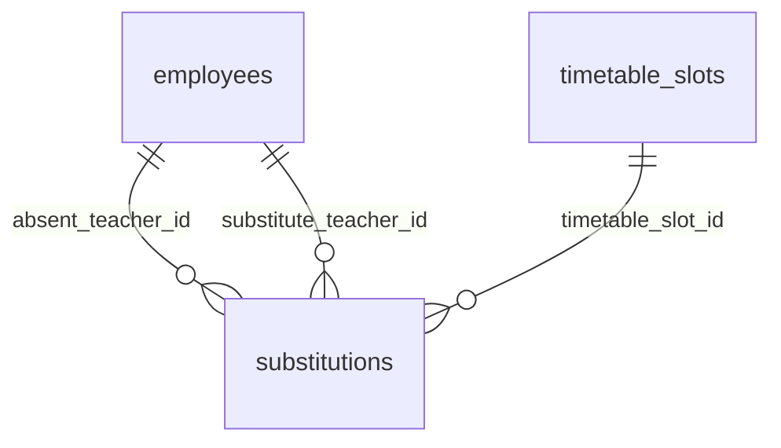

### `substitutions`

*0 rows / 10 columns*

One period, one day, covered by somebody else (§5.7.9).

**Points at:** `employees`, `schools`, `timetable_slots`

**Unique on:** `timetable_slot_id,date`

| Column | Type | Null | Notes |
|---|---|---|---|
| `id` | bigint | no | primary key |
| `school_id` | bigint | no | -> `schools.id` |
| `timetable_slot_id` | bigint | no | -> `timetable_slots.id`, unique |
| `date` | date | no | unique |
| `absent_teacher_id` | bigint | no | -> `employees.id` |
| `substitute_teacher_id` | bigint | yes | -> `employees.id` |
| `reason` | text | no | - |
| `status` | varchar(9) | no | - |
| `created_at` | timestamptz | no | default `now()` |
| `updated_at` | timestamptz | no | default `now()` |

## Attendance

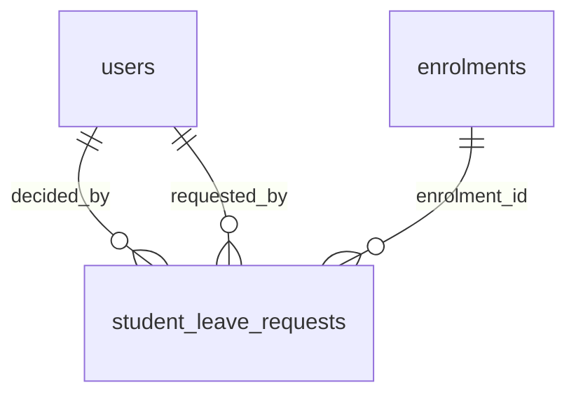

### `student_leave_requests`

*0 rows / 14 columns*

A guardian asking for a child to be away (§5.8.5).

**Points at:** `enrolments`, `schools`, `users`

| Column | Type | Null | Notes |
|---|---|---|---|
| `id` | bigint | no | primary key |
| `school_id` | bigint | no | -> `schools.id` |
| `enrolment_id` | bigint | no | -> `enrolments.id` |
| `from_date` | date | no | - |
| `to_date` | date | no | - |
| `type` | varchar(9) | no | - |
| `reason` | text | no | - |
| `status` | varchar(9) | no | - |
| `requested_by` | bigint | yes | -> `users.id` |
| `decided_by` | bigint | yes | -> `users.id` |
| `decided_at` | timestamptz | yes | - |
| `decision_note` | text | yes | - |
| `created_at` | timestamptz | no | default `now()` |
| `updated_at` | timestamptz | no | default `now()` |

## Examinations and results

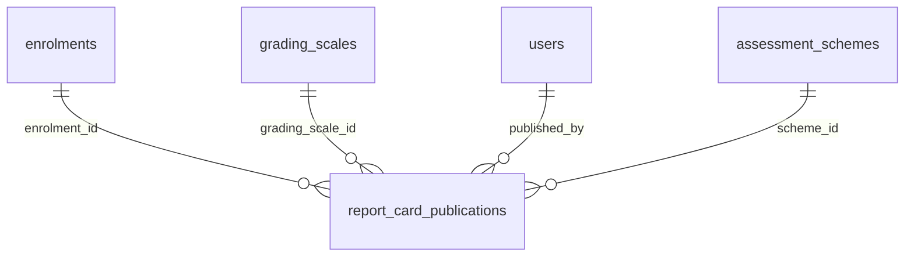

### `report_card_publications`

*0 rows / 13 columns*

A published report card: frozen, numbered, and citing its own rules.

**Points at:** `assessment_schemes`, `enrolments`, `grading_scales`, `schools`, `users`

**Unique on:** `enrolment_id,term`

| Column | Type | Null | Notes |
|---|---|---|---|
| `id` | bigint | no | primary key |
| `school_id` | bigint | no | -> `schools.id` |
| `enrolment_id` | bigint | no | -> `enrolments.id`, unique |
| `term` | varchar(20) | no | unique |
| `scheme_id` | bigint | no | -> `assessment_schemes.id` |
| `grading_scale_id` | bigint | no | -> `grading_scales.id` |
| `document_no` | varchar(32) | no | - |
| `published_at` | timestamptz | no | - |
| `published_by` | bigint | yes | -> `users.id` |
| `result_status` | varchar(20) | no | - |
| `payload` | json | no | - |
| `created_at` | timestamptz | no | default `now()` |
| `updated_at` | timestamptz | no | default `now()` |

## Fees and money

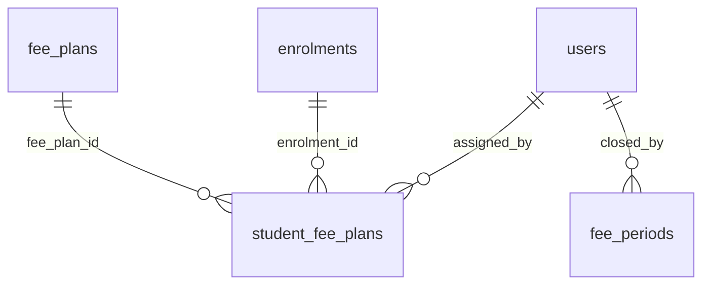

### `student_fee_plans`

*0 rows / 7 columns*

An individual override of the class default. Keyed to the enrolment, not the
student: what a child is charged is a fact about a year (§3.2).

**Points at:** `enrolments`, `fee_plans`, `schools`, `users`

**Unique on:** `enrolment_id`

| Column | Type | Null | Notes |
|---|---|---|---|
| `id` | bigint | no | primary key |
| `school_id` | bigint | no | -> `schools.id` |
| `enrolment_id` | bigint | no | -> `enrolments.id`, unique |
| `fee_plan_id` | bigint | no | -> `fee_plans.id` |
| `assigned_by` | bigint | yes | -> `users.id` |
| `created_at` | timestamptz | no | default `now()` |
| `updated_at` | timestamptz | no | default `now()` |

### `fee_periods`

*0 rows / 10 columns*

One billing month's books, open or closed.

**Points at:** `schools`, `users`

**Unique on:** `school_id,period_year,period_month`

| Column | Type | Null | Notes |
|---|---|---|---|
| `id` | bigint | no | primary key |
| `school_id` | bigint | no | -> `schools.id`, unique |
| `period_year` | integer | no | unique |
| `period_month` | integer | no | unique |
| `status` | varchar(6) | no | - |
| `closed_by` | bigint | yes | -> `users.id` |
| `closed_at` | timestamptz | yes | - |
| `note` | text | yes | - |
| `created_at` | timestamptz | no | default `now()` |
| `updated_at` | timestamptz | no | default `now()` |

## HR and payroll

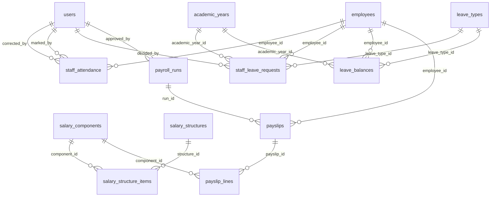

### `staff_attendance`

*0 rows / 12 columns*

One day, one member of staff, one mark.

**Points at:** `employees`, `schools`, `users`

**Unique on:** `employee_id,date`

| Column | Type | Null | Notes |
|---|---|---|---|
| `id` | bigint | no | primary key |
| `school_id` | bigint | no | -> `schools.id` |
| `employee_id` | bigint | no | -> `employees.id`, unique |
| `date` | date | no | unique |
| `status` | varchar(8) | no | - |
| `check_in` | time without time zone | yes | - |
| `check_out` | time without time zone | yes | - |
| `marked_by` | bigint | yes | -> `users.id` |
| `corrected_by` | bigint | yes | -> `users.id` |
| `remarks` | varchar(200) | yes | - |
| `created_at` | timestamptz | no | default `now()` |
| `updated_at` | timestamptz | no | default `now()` |

### `staff_leave_requests`

*0 rows / 17 columns*

One application, from draft to decision.

**Points at:** `academic_years`, `employees`, `leave_types`, `schools`, `users`

| Column | Type | Null | Notes |
|---|---|---|---|
| `id` | bigint | no | primary key |
| `school_id` | bigint | no | -> `schools.id` |
| `employee_id` | bigint | no | -> `employees.id` |
| `leave_type_id` | bigint | no | -> `leave_types.id` |
| `academic_year_id` | bigint | no | -> `academic_years.id` |
| `from_date` | date | no | - |
| `to_date` | date | no | - |
| `is_half_day` | boolean | no | default `false` |
| `days` | numeric(5,1) | no | - |
| `reason` | text | no | - |
| `status` | varchar(9) | no | default `'applied'` |
| `balance_exception` | boolean | no | default `false` |
| `decided_by` | bigint | yes | -> `users.id` |
| `decided_at` | timestamptz | yes | - |
| `decision_note` | text | yes | - |
| `created_at` | timestamptz | no | default `now()` |
| `updated_at` | timestamptz | no | default `now()` |

### `leave_balances`

*0 rows / 9 columns*

What one employee has left of one type, this year.

**Points at:** `academic_years`, `employees`, `leave_types`, `schools`

**Unique on:** `employee_id,leave_type_id,academic_year_id`

| Column | Type | Null | Notes |
|---|---|---|---|
| `id` | bigint | no | primary key |
| `school_id` | bigint | no | -> `schools.id` |
| `employee_id` | bigint | no | -> `employees.id`, unique |
| `leave_type_id` | bigint | no | -> `leave_types.id`, unique |
| `academic_year_id` | bigint | no | -> `academic_years.id`, unique |
| `entitled` | numeric(5,1) | no | - |
| `used` | numeric(5,1) | no | default `'0'` |
| `created_at` | timestamptz | no | default `now()` |
| `updated_at` | timestamptz | no | default `now()` |

### `salary_structure_items`

*0 rows / 8 columns*

A per-employee override of one component's value.

**Points at:** `salary_components`, `salary_structures`, `schools`

**Unique on:** `structure_id,component_id`

| Column | Type | Null | Notes |
|---|---|---|---|
| `id` | bigint | no | primary key |
| `school_id` | bigint | no | -> `schools.id` |
| `structure_id` | bigint | no | -> `salary_structures.id`, unique |
| `component_id` | bigint | no | -> `salary_components.id`, unique |
| `value` | numeric(12,2) | no | - |
| `included` | boolean | no | default `true` |
| `created_at` | timestamptz | no | default `now()` |
| `updated_at` | timestamptz | no | default `now()` |

### `payroll_runs`

*0 rows / 15 columns*

One month's payroll, once.

**Points at:** `schools`, `users`

**Pointed at by:** `payslips`

**Unique on:** `school_id,year,month,run_no`

| Column | Type | Null | Notes |
|---|---|---|---|
| `id` | bigint | no | primary key |
| `school_id` | bigint | no | -> `schools.id`, unique |
| `year` | integer | no | unique |
| `month` | integer | no | unique |
| `run_no` | integer | no | unique, default `1` |
| `is_supplementary` | boolean | no | default `false` |
| `status` | varchar(10) | no | default `'draft'` |
| `working_days` | integer | yes | - |
| `calculated_at` | timestamptz | yes | - |
| `approved_at` | timestamptz | yes | - |
| `approved_by` | bigint | yes | -> `users.id` |
| `paid_at` | timestamptz | yes | - |
| `note` | text | yes | - |
| `created_at` | timestamptz | no | default `now()` |
| `updated_at` | timestamptz | no | default `now()` |

### `payslips`

*0 rows / 14 columns*

One person, one run. The totals are stored, not derived on read.

**Points at:** `employees`, `payroll_runs`, `schools`

**Pointed at by:** `payslip_lines`

**Unique on:** `run_id,employee_id`, `school_id,payslip_no`

| Column | Type | Null | Notes |
|---|---|---|---|
| `id` | bigint | no | primary key |
| `school_id` | bigint | no | -> `schools.id`, unique |
| `run_id` | bigint | no | -> `payroll_runs.id`, unique |
| `employee_id` | bigint | no | -> `employees.id`, unique |
| `payslip_no` | varchar(32) | no | unique |
| `working_days` | integer | no | - |
| `lop_days` | numeric(5,1) | no | default `'0'` |
| `monthly_gross` | numeric(12,2) | no | - |
| `total_earnings` | numeric(12,2) | no | - |
| `total_deductions` | numeric(12,2) | no | - |
| `net_pay` | numeric(12,2) | no | - |
| `employer_cost` | numeric(12,2) | no | - |
| `created_at` | timestamptz | no | default `now()` |
| `updated_at` | timestamptz | no | default `now()` |

### `payslip_lines`

*0 rows / 11 columns*

One component on one payslip, as it was computed.

**Points at:** `payslips`, `salary_components`, `schools`

**Unique on:** `payslip_id,code`

| Column | Type | Null | Notes |
|---|---|---|---|
| `id` | bigint | no | primary key |
| `school_id` | bigint | no | -> `schools.id` |
| `payslip_id` | bigint | no | -> `payslips.id`, unique |
| `component_id` | bigint | yes | -> `salary_components.id` |
| `code` | varchar(16) | no | unique |
| `name` | varchar(60) | no | - |
| `type` | varchar(21) | no | - |
| `amount` | numeric(12,2) | no | - |
| `sequence` | integer | no | default `0` |
| `created_at` | timestamptz | no | default `now()` |
| `updated_at` | timestamptz | no | default `now()` |

## Admission

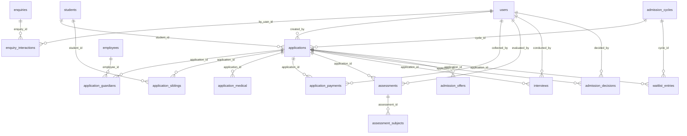

### `enquiry_interactions`

*0 rows / 10 columns*

One logged contact. Append-only in practice: the follow-up history is the
evidence behind a conversion number.

**Points at:** `enquiries`, `schools`, `users`

| Column | Type | Null | Notes |
|---|---|---|---|
| `school_id` | bigint | no | -> `schools.id` |
| `enquiry_id` | bigint | no | -> `enquiries.id` |
| `occurred_at` | timestamptz | no | - |
| `channel` | varchar(8) | no | - |
| `notes` | text | yes | - |
| `outcome` | varchar(23) | yes | - |
| `by_user_id` | bigint | yes | -> `users.id` |
| `id` | bigint | no | primary key |
| `created_at` | timestamptz | no | default `now()` |
| `updated_at` | timestamptz | no | default `now()` |

### `applications`

*0 rows / 39 columns*

One child's candidacy in one cycle.

**Points at:** `admission_cycles`, `applications`, `schools`, `students`, `users`

**Pointed at by:** `admission_decisions`, `admission_offers`, `application_guardians`, `application_medical`, `application_payments`, `application_siblings`, `assessments`, `enquiries`, `interviews`, `message_recipients`, `waitlist_entries`

**Unique on:** `school_id,application_no`

| Column | Type | Null | Notes |
|---|---|---|---|
| `school_id` | bigint | no | -> `schools.id`, unique |
| `cycle_id` | bigint | no | -> `admission_cycles.id` |
| `application_no` | varchar(24) | yes | unique |
| `first_name` | varchar(60) | no | - |
| `middle_name` | varchar(60) | yes | - |
| `last_name` | varchar(60) | no | - |
| `date_of_birth` | date | no | - |
| `gender` | varchar(12) | no | - |
| `nationality` | varchar(40) | yes | - |
| `religion` | varchar(40) | yes | - |
| `caste_category` | varchar(12) | yes | - |
| `mother_tongue` | varchar(40) | yes | - |
| `place_of_birth` | varchar(80) | yes | - |
| `identification_marks` | text | yes | - |
| `is_single_child` | boolean | no | default `false` |
| `aadhaar_last4` | varchar(4) | yes | - |
| `aadhaar_verified` | boolean | no | default `false` |
| `class_applying_for` | varchar(8) | no | - |
| `stream` | varchar(20) | yes | - |
| `second_language` | varchar(40) | yes | - |
| `optional_subject` | varchar(40) | yes | - |
| `preferred_section` | varchar(4) | yes | - |
| `admission_category` | varchar(12) | no | default `'general'` |
| `transport_required` | boolean | no | default `false` |
| `status` | varchar(27) | no | default `'draft'` |
| `submitted_at` | timestamptz | yes | - |
| `source` | varchar(10) | no | default `'walk_in'` |
| `created_by` | bigint | yes | -> `users.id` |
| `address` | json | yes | - |
| `previous_school` | json | yes | - |
| `declarations` | json | yes | - |
| `sibling_verified` | boolean | no | default `false` |
| `staff_ward_verified` | boolean | no | default `false` |
| `age_override_reason` | text | yes | - |
| `previous_application_id` | bigint | yes | -> `applications.id` |
| `student_id` | bigint | yes | -> `students.id` |
| `id` | bigint | no | primary key |
| `created_at` | timestamptz | no | default `now()` |
| `updated_at` | timestamptz | no | default `now()` |

### `application_guardians`

*0 rows / 23 columns*

Repeatable: father, mother, guardian (§5.1.4 step 3).

**Points at:** `applications`, `employees`, `schools`

| Column | Type | Null | Notes |
|---|---|---|---|
| `school_id` | bigint | no | -> `schools.id` |
| `application_id` | bigint | no | -> `applications.id` |
| `relation` | varchar(14) | no | - |
| `full_name` | varchar(120) | no | - |
| `date_of_birth` | date | yes | - |
| `qualification` | varchar(120) | yes | - |
| `occupation` | varchar(80) | yes | - |
| `designation` | varchar(80) | yes | - |
| `organisation` | varchar(120) | yes | - |
| `annual_income_band` | varchar(40) | yes | - |
| `office_address` | text | yes | - |
| `mobile` | varchar(20) | no | - |
| `alternate_mobile` | varchar(20) | yes | - |
| `email` | varchar(160) | yes | - |
| `is_primary` | boolean | no | default `false` |
| `is_emergency_contact` | boolean | no | default `false` |
| `is_authorised_for_pickup` | boolean | no | default `false` |
| `is_school_alumnus` | boolean | no | default `false` |
| `is_school_staff` | boolean | no | default `false` |
| `employee_id` | bigint | yes | -> `employees.id` |
| `id` | bigint | no | primary key |
| `created_at` | timestamptz | no | default `now()` |
| `updated_at` | timestamptz | no | default `now()` |

### `application_siblings`

*0 rows / 9 columns*

Step 4. A sibling already in the school is a link to a real student, never free
text, because it drives a fee concession.

**Points at:** `applications`, `schools`, `students`

| Column | Type | Null | Notes |
|---|---|---|---|
| `school_id` | bigint | no | -> `schools.id` |
| `application_id` | bigint | no | -> `applications.id` |
| `student_id` | bigint | yes | -> `students.id` |
| `name` | varchar(120) | yes | - |
| `age` | integer | yes | - |
| `school_name` | varchar(160) | yes | - |
| `id` | bigint | no | primary key |
| `created_at` | timestamptz | no | default `now()` |
| `updated_at` | timestamptz | no | default `now()` |

### `application_medical`

*0 rows / 15 columns*

Step 7, in its own table because §15 requires it to be permission-gated
separately from everything else on the application.

**Points at:** `applications`, `schools`

**Unique on:** `application_id`

| Column | Type | Null | Notes |
|---|---|---|---|
| `school_id` | bigint | no | -> `schools.id` |
| `application_id` | bigint | no | -> `applications.id`, unique |
| `blood_group` | varchar(8) | yes | - |
| `known_allergies` | text | yes | - |
| `chronic_conditions` | text | yes | - |
| `regular_medication` | text | yes | - |
| `physical_disability` | text | yes | - |
| `learning_needs` | text | yes | - |
| `vision_hearing_notes` | text | yes | - |
| `emergency_doctor` | varchar(160) | yes | - |
| `emergency_doctor_phone` | varchar(20) | yes | - |
| `consent_for_emergency_treatment` | boolean | no | default `false` |
| `id` | bigint | no | primary key |
| `created_at` | timestamptz | no | default `now()` |
| `updated_at` | timestamptz | no | default `now()` |

### `application_payments`

*0 rows / 15 columns*

The application fee paid against an application. Separate from `fee_payments`
because an applicant is not a student and has no enrolment.

**Points at:** `applications`, `schools`, `users`

**Unique on:** `idempotency_key`, `school_id,receipt_no`

| Column | Type | Null | Notes |
|---|---|---|---|
| `id` | bigint | no | primary key |
| `school_id` | bigint | no | -> `schools.id`, unique |
| `application_id` | bigint | no | -> `applications.id` |
| `purpose` | varchar(15) | no | - |
| `amount` | numeric(10,2) | no | - |
| `method` | varchar(20) | no | - |
| `reference` | varchar(80) | yes | - |
| `receipt_no` | varchar(24) | no | unique |
| `paid_at` | timestamptz | no | - |
| `collected_by` | bigint | yes | -> `users.id` |
| `status` | varchar(8) | no | default `'paid'` |
| `void_reason` | text | yes | - |
| `idempotency_key` | varchar(120) | yes | unique |
| `created_at` | timestamptz | no | default `now()` |
| `updated_at` | timestamptz | no | default `now()` |

### `assessments`

*0 rows / 15 columns*

One test or observation for one applicant.

**Points at:** `applications`, `schools`, `users`

**Pointed at by:** `assessment_subjects`

| Column | Type | Null | Notes |
|---|---|---|---|
| `school_id` | bigint | no | -> `schools.id` |
| `application_id` | bigint | no | -> `applications.id` |
| `assessment_type` | varchar(22) | no | - |
| `scheduled_at` | timestamptz | no | - |
| `venue` | varchar(80) | yes | - |
| `seat_no` | varchar(16) | yes | - |
| `status` | varchar(9) | no | default `'scheduled'` |
| `total_marks` | numeric(6,2) | yes | - |
| `obtained_marks` | numeric(6,2) | yes | - |
| `is_absent` | boolean | no | default `false` |
| `evaluated_by` | bigint | yes | -> `users.id` |
| `remarks` | text | yes | - |
| `id` | bigint | no | primary key |
| `created_at` | timestamptz | no | default `now()` |
| `updated_at` | timestamptz | no | default `now()` |

### `assessment_subjects`

*0 rows / 8 columns*

Subject-wise marks, for the assessments that have subjects at all.

**Points at:** `assessments`, `schools`

**Unique on:** `assessment_id,subject`

| Column | Type | Null | Notes |
|---|---|---|---|
| `school_id` | bigint | no | -> `schools.id` |
| `assessment_id` | bigint | no | -> `assessments.id`, unique |
| `subject` | varchar(60) | no | unique |
| `max_marks` | numeric(6,2) | no | - |
| `obtained` | numeric(6,2) | yes | - |
| `id` | bigint | no | primary key |
| `created_at` | timestamptz | no | default `now()` |
| `updated_at` | timestamptz | no | default `now()` |

### `interviews`

*0 rows / 15 columns*

An admission interview: when, with whom, and what was concluded.

**Points at:** `applications`, `schools`, `users`

| Column | Type | Null | Notes |
|---|---|---|---|
| `school_id` | bigint | no | -> `schools.id` |
| `application_id` | bigint | no | -> `applications.id` |
| `scheduled_at` | timestamptz | no | - |
| `venue` | varchar(80) | yes | - |
| `panel_member_ids` | json | yes | - |
| `status` | varchar(9) | no | default `'scheduled'` |
| `structured_scores` | json | yes | - |
| `child_rating` | integer | yes | - |
| `parent_rating` | integer | yes | - |
| `recommendation` | varchar(12) | yes | - |
| `notes` | text | yes | - |
| `conducted_by` | bigint | yes | -> `users.id` |
| `id` | bigint | no | primary key |
| `created_at` | timestamptz | no | default `now()` |
| `updated_at` | timestamptz | no | default `now()` |

### `admission_decisions`

*0 rows / 12 columns*

Append-only. A reversal is a new row, not an edit of the old one — the history
of who decided what, and why, is the whole point (§5.1.9(13)).

**Points at:** `applications`, `schools`, `users`

| Column | Type | Null | Notes |
|---|---|---|---|
| `school_id` | bigint | no | -> `schools.id` |
| `application_id` | bigint | no | -> `applications.id` |
| `decision` | varchar(10) | no | - |
| `decided_by` | bigint | yes | -> `users.id` |
| `decided_at` | timestamptz | no | - |
| `reason` | text | no | - |
| `seat_category` | varchar(20) | yes | - |
| `conditions` | text | yes | - |
| `over_allocation_approved` | boolean | no | default `false` |
| `id` | bigint | no | primary key |
| `created_at` | timestamptz | no | default `now()` |
| `updated_at` | timestamptz | no | default `now()` |

### `admission_offers`

*0 rows / 11 columns*

An offer of a place made to an applicant, with its expiry and whether it was
taken up.

**Points at:** `applications`, `schools`

| Column | Type | Null | Notes |
|---|---|---|---|
| `school_id` | bigint | no | -> `schools.id` |
| `application_id` | bigint | no | -> `applications.id` |
| `offered_at` | timestamptz | no | - |
| `expires_on` | date | no | - |
| `offer_amount` | numeric(10,2) | yes | - |
| `status` | varchar(9) | no | default `'issued'` |
| `accepted_at` | timestamptz | yes | - |
| `released_at` | timestamptz | yes | - |
| `id` | bigint | no | primary key |
| `created_at` | timestamptz | no | default `now()` |
| `updated_at` | timestamptz | no | default `now()` |

### `waitlist_entries`

*0 rows / 9 columns*

An ordered queue per class, not a label on an application.

**Points at:** `admission_cycles`, `applications`, `schools`

**Unique on:** `application_id`, `cycle_id,class_name,rank`

| Column | Type | Null | Notes |
|---|---|---|---|
| `school_id` | bigint | no | -> `schools.id` |
| `cycle_id` | bigint | no | -> `admission_cycles.id`, unique |
| `class_name` | varchar(8) | no | unique |
| `application_id` | bigint | no | -> `applications.id`, unique |
| `rank` | integer | no | unique |
| `status` | varchar(9) | no | default `'waiting'` |
| `id` | bigint | no | primary key |
| `created_at` | timestamptz | no | default `now()` |
| `updated_at` | timestamptz | no | default `now()` |

## Communication

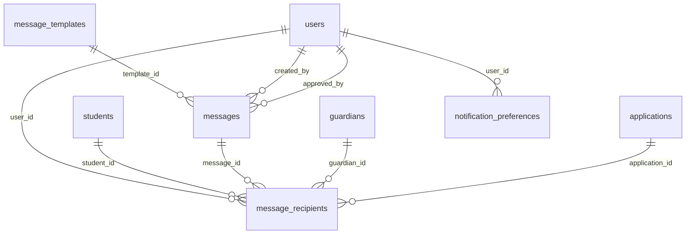

### `messages`

*0 rows / 17 columns*

One send: a body, an audience, and a status.

**Points at:** `message_templates`, `schools`, `users`

**Pointed at by:** `message_recipients`, `notices`

| Column | Type | Null | Notes |
|---|---|---|---|
| `id` | bigint | no | primary key |
| `school_id` | bigint | no | -> `schools.id` |
| `category` | varchar(11) | no | - |
| `channel` | varchar(8) | no | default `'email'` |
| `template_id` | bigint | yes | -> `message_templates.id` |
| `template_version` | integer | yes | - |
| `subject` | varchar(200) | no | - |
| `body` | text | no | - |
| `audience` | json | no | - |
| `status` | varchar(9) | no | default `'draft'` |
| `scheduled_for` | timestamptz | yes | - |
| `sent_at` | timestamptz | yes | - |
| `created_by` | bigint | yes | -> `users.id` |
| `approved_by` | bigint | yes | -> `users.id` |
| `approved_at` | timestamptz | yes | - |
| `created_at` | timestamptz | no | default `now()` |
| `updated_at` | timestamptz | no | default `now()` |

### `message_recipients`

*0 rows / 17 columns*

One person, one address, one delivery outcome.

**Points at:** `applications`, `guardians`, `messages`, `schools`, `students`, `users`

| Column | Type | Null | Notes |
|---|---|---|---|
| `id` | bigint | no | primary key |
| `school_id` | bigint | no | -> `schools.id` |
| `message_id` | bigint | no | -> `messages.id` |
| `user_id` | bigint | yes | -> `users.id` |
| `guardian_id` | bigint | yes | -> `guardians.id` |
| `student_id` | bigint | yes | -> `students.id` |
| `application_id` | bigint | yes | -> `applications.id` |
| `to_address` | varchar(200) | no | - |
| `channel` | varchar(8) | no | default `'email'` |
| `context` | json | no | - |
| `status` | varchar(9) | no | default `'queued'` |
| `attempts` | integer | no | default `0` |
| `sent_at` | timestamptz | yes | - |
| `failure_reason` | text | yes | - |
| `provider_ref` | varchar(120) | yes | - |
| `created_at` | timestamptz | no | default `now()` |
| `updated_at` | timestamptz | no | default `now()` |

### `notification_preferences`

*0 rows / 8 columns*

One opt-out, per person per category per channel.

**Points at:** `schools`, `users`

**Unique on:** `user_id,category,channel`

| Column | Type | Null | Notes |
|---|---|---|---|
| `id` | bigint | no | primary key |
| `school_id` | bigint | no | -> `schools.id` |
| `user_id` | bigint | no | -> `users.id`, unique |
| `category` | varchar(11) | no | unique |
| `channel` | varchar(8) | no | unique, default `'email'` |
| `opted_out` | boolean | no | default `true` |
| `created_at` | timestamptz | no | default `now()` |
| `updated_at` | timestamptz | no | default `now()` |

## System

### `jobs`

*0 rows / 16 columns*

The background work queue - messages to send, report cards to build. Drained by
`worker.py`.

**Points at:** `schools`

**Unique on:** `idempotency_key`

| Column | Type | Null | Notes |
|---|---|---|---|
| `school_id` | bigint | no | -> `schools.id` |
| `kind` | varchar(48) | no | - |
| `payload` | json | yes | - |
| `status` | varchar(9) | no | default `'pending'` |
| `run_after` | timestamptz | no | - |
| `started_at` | timestamptz | yes | - |
| `finished_at` | timestamptz | yes | - |
| `attempts` | integer | no | default `0` |
| `max_attempts` | integer | no | default `3` |
| `last_error` | text | yes | - |
| `result` | json | yes | - |
| `idempotency_key` | varchar(120) | yes | unique |
| `requested_by` | bigint | yes | - |
| `id` | bigint | no | primary key |
| `created_at` | timestamptz | no | default `now()` |
| `updated_at` | timestamptz | no | default `now()` |

---

# Appendix - joins you will actually write

Every query below was run against this database before it was written down.

**A student with their class and roll number**

```sql
SELECT s.admission_no, u.full_name, cs.class_name || '-' || cs.section AS class, e.roll_no
FROM students s
JOIN users u ON u.id = s.user_id
JOIN enrolments e ON e.student_id = s.id
JOIN class_sections cs ON cs.id = e.class_section_id
ORDER BY s.admission_no;
```

Note the shape. `students` holds the lifetime facts, `enrolments` holds the
year, and the class arrives through the enrolment. There is no `class_id` on
`students`, and there should never be one.

**What each family owes**

```sql
SELECT u.full_name,
       sum(l.amount - l.discount) - coalesce(sum(a.amount), 0) AS outstanding
FROM fee_invoices i
JOIN fee_invoice_lines l ON l.invoice_id = i.id
JOIN enrolments e ON e.id = i.enrolment_id
JOIN students s ON s.id = e.student_id
JOIN users u ON u.id = s.user_id
LEFT JOIN payment_allocations a ON a.invoice_line_id = l.id
GROUP BY u.full_name
ORDER BY outstanding DESC;
```

Rule 4 in practice: nothing stores a balance, so you subtract what was allocated
from what was billed. The `LEFT JOIN` matters - a family who has paid nothing
has no allocation rows at all, and an inner join would hide them entirely.

**Which bus a child catches, and from where**

```sql
SELECT u.full_name, r.code, st.name AS stop, st.pickup_time
FROM transport_assignments ta
JOIN route_stops st ON st.id = ta.route_stop_id
JOIN routes r ON r.id = st.route_id
JOIN enrolments e ON e.id = ta.enrolment_id
JOIN students s ON s.id = e.student_id
JOIN users u ON u.id = s.user_id
ORDER BY r.code, st.sequence;
```

**Every member of staff, by group**

```sql
SELECT e.employee_code, u.full_name, e.employee_type, e.designation, d.name AS department
FROM employees e
JOIN users u ON u.id = e.user_id
LEFT JOIN departments d ON d.id = e.department_id
ORDER BY e.employee_type, e.employee_code;
```

**Who changed what, and why**

```sql
SELECT occurred_at, actor_label, entity_type, action, reason
FROM audit_log
WHERE reason IS NOT NULL
ORDER BY id DESC
LIMIT 50;
```

---

# Keeping this file true

The columns and relationships above come from the database, not from memory, and
a migration makes them stale. Regenerate rather than editing by hand - the
generator lives in `scripts/`.
