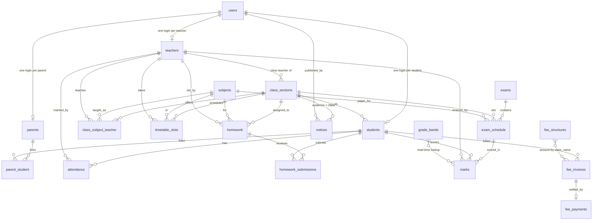

# Entity relationships

21 tables. Every table has `id BIGSERIAL PRIMARY KEY`, `created_at TIMESTAMPTZ NOT NULL
DEFAULT now()` and, where mutable, `updated_at TIMESTAMPTZ`. Column detail lives in
BLUEPRINT section 7; this page is the shape.

## The constraints that carry the rules

These are not incidental; each one is a domain rule the application depends on.

| Table | Constraint | Enforces |
|---|---|---|
| `users` | UNIQUE `login_id` | One login namespace across all four roles (D11) |
| `attendance` | UNIQUE `(student_id, date)` | Attendance is once per day, not per period (D2) |
| `homework_submissions` | UNIQUE `(homework_id, student_id)` | Resubmission updates in place; there is no status column |
| `parent_student` | UNIQUE `(parent_id, student_id)` | The join table behind the sibling switcher |
| `class_subject_teacher` | UNIQUE `(class_section_id, subject_id)` | One owner per subject per section; the basis of teacher scoping |
| `timetable_slots` | UNIQUE `(class_section_id, day_of_week, period_no)` | No double-booked period |
| `exam_schedule` | UNIQUE `(exam_id, class_section_id, subject_id)` | One paper per subject per section per exam |
| `marks` | UNIQUE `(exam_schedule_id, student_id)`, CHECK `>= 0` | Marks entry is an upsert; no negative scores |
| `fee_invoices` | UNIQUE `(student_id, month, year)` | Invoice generation is idempotent |
| `fee_payments` | UNIQUE `invoice_id`, UNIQUE `receipt_no` | One payment per invoice; receipt numbers never repeat |
| `class_sections` | UNIQUE `(class_name, section, academic_year)` | 10-A exists once per year |

## Things deliberately absent

- No `school_id`: single tenant, one deployment per school (D1).
- No stored grade on `marks`: grades are computed at read time from `grade_bands` (section 7.5).
- No `status` on `homework_submissions`: a row exists or it does not (section 7.4).
- No class rank anywhere (D3).
